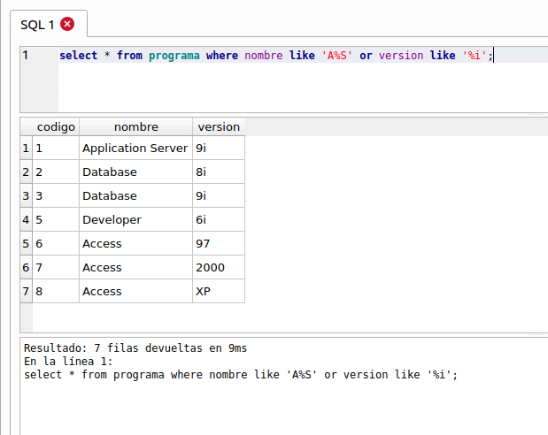
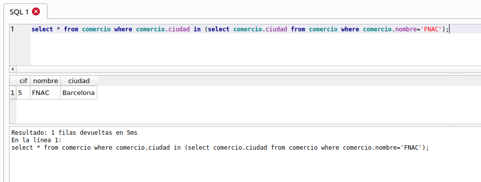

# Tarea 1 BBDD con sqlite

## 1. Creación de las tablas

Sql a ejectuar para la creación de las tablas:

    CREATE TABLE fabricante (
    id_fab integer primary key,
    nombre text,
    pais   text
    );

    CREATE TABLE programa(
    codigo integer primary key,
    nombre text,
    version text
    );

    CREATE TABLE comercio(
    cif integer primary key,
    nombre text,
    ciudad text
    );

    CREATE TABLE cliente(
    dni integer primary key,
    nombre text,
    edad integer
    );

    CREATE TABLE desarrolla(
    id_fab integer,
    codigo integer,
    primary key(id_fab,codigo)
    );

    CREATE TABLE distribuye(
    cif integer,
    codigo integer,
    cantidad integer,
    primary key(cif,codigo)
    );

    CREATE TABLE registra(
    cif integer,
    dni integer,
    codigo integer,
    medio text,
    primary key(cif,dni)
    );
    

    insert into fabricante values(1,'Oracle','Estados Unidos');
    insert into fabricante values(2,'Microsoft','Estados Unidos');
    insert into fabricante values(3,'IBM','Estados Unidos');
    insert into fabricante values(4,'Dinamic','España');
    insert into fabricante values(5,'Borland','Estados Unidos');
    insert into fabricante values(6,'Symantec','Estados Unidos');

    insert into programa values(1,'Application Server','9i');
    insert into programa values(2,'Database','8i');
    insert into programa values(3,'Database','9i');
    insert into programa values(4,'Database','10g');
    insert into programa values(5,'Developer','6i');
    insert into programa values(6,'Access','97');
    insert into programa values(7,'Access','2000');
    insert into programa values(8,'Access','XP');
    insert into programa values(9,'Windows','98');
    insert into programa values(10,'Windows','XP Professional');
    insert into programa values(11,'Windows','XP Home Edition');
    insert into programa values(12,'Windows','2003 Server');
    insert into programa values(13,'Norton Internet Security','2004');
    insert into programa values(14,'Freddy Hardest',NULL);
    insert into programa values(15,'Paradox','2');
    insert into programa values(16,'C++ Builder','5.5');
    insert into programa values(17,'DB/2','2.0');
    insert into programa values(18,'OS/2','1.0');
    insert into programa values(19,'JBuilder','X');
    insert into programa values(20,'La prisión','1.0');

    insert into comercio values(1,'El Corte Inglés','Sevilla');
    insert into comercio values(2,'El Corte Inglés','Madrid');
    insert into comercio values(3,'Jump','Valencia');
    insert into comercio values(4,'Centro Mail','Sevilla');
    insert into comercio values(5,'FNAC','Barcelona');

    insert into cliente values(1,'Pepe Pérez',45);
    insert into cliente values(2,'Juan González',45);
    insert into cliente values(3,'María Gómez',33);
    insert into cliente values(4,'Javier Casado',18);
    insert into cliente values(5,'Nuria Sánchez',29);
    insert into cliente values(6,'Antonio Navarro',58);

    insert into desarrolla values(1,1);
    insert into desarrolla values(1,2);
    insert into desarrolla values(1,3);
    insert into desarrolla values(1,4);
    insert into desarrolla values(1,5);
    insert into desarrolla values(2,6);
    insert into desarrolla values(2,7);
    insert into desarrolla values(2,8);
    insert into desarrolla values(2,9);
    insert into desarrolla values(2,10);
    insert into desarrolla values(2,11);
    insert into desarrolla values(2,12);
    insert into desarrolla values(6,13);
    insert into desarrolla values(4,14);
    insert into desarrolla values(5,15);
    insert into desarrolla values(5,16);
    insert into desarrolla values(3,17);
    insert into desarrolla values(3,18);
    insert into desarrolla values(5,19);
    insert into desarrolla values(4,20);

    insert into distribuye values(1,1,10);
    insert into distribuye values(1,2,11);
    insert into distribuye values(1,6,5);
    insert into distribuye values(1,7,3);
    insert into distribuye values(1,10,5);
    insert into distribuye values(1,13,7);
    insert into distribuye values(2,1,6);
    insert into distribuye values(2,2,6);
    insert into distribuye values(2,6,4);
    insert into distribuye values(2,7,7);
    insert into distribuye values(3,10,8);
    insert into distribuye values(3,13,5);
    insert into distribuye values(4,14,3);
    insert into distribuye values(4,20,6);
    insert into distribuye values(5,15,8);
    insert into distribuye values(5,16,2);
    insert into distribuye values(5,17,3);
    insert into distribuye values(5,19,6);
    insert into distribuye values(5,8,8);

    insert into registra values(1,1,1,'Internet');
    insert into registra values(1,3,4,'Tarjeta postal');
    insert into registra values(4,2,10,'Teléfono');
    insert into registra values(4,1,10,'Tarjeta postal');
    insert into registra values(5,2,12,'Internet');
    insert into registra values(2,4,15,'Internet');

Resultado obtenido:

## 2. Consultas 

2.1 Averigua el DNI de todos los clientes. 

2.2 Consulta todos los datos de todos los programas. 

2.3 Obtén un listado con los nombres de todos los programas. 

2.4 Genera una lista con todos los comercios. 

2.5 Genera una lista de las ciudades con establecimientos donde se venden programas, sin que aparezcan valores duplicados (utiliza DISTINCT). 

2.6 Obtén una lista con los nombres de programas, sin que aparezcan valores duplicados (utiliza DISTINCT).

2.7 Obtén el DNI más 4 de todos los clientes. 

2.8 Haz un listado con los códigos de los programas multiplicados por 7.

2.9 ¿Cuáles son los programas cuyo código es inferior o igual a 10? 

2.10 ¿Cuál es el programa cuyo código es 11? 

2.11 ¿Qué fabricantes son de Estados Unidos? 

2.12 ¿Cuáles son los fabricantes no españoles? Utilizar el operador IN. 

2.13 Obtén un listado con los códigos de las distintas versiones de Windows. 

2.14 ¿En qué ciudades comercializa programas El Corte Inglés? 

2.15 ¿Qué otros comercios hay, además de El Corte Inglés? Utilizar el operador IN. 

2.16 Genera una lista con los códigos de las distintas versiones de Windows y Access. Utilizar el operador IN.

2.17 Obtén un listado que incluya los nombres de los clientes de edades comprendidas entre 10 y 25 y de los mayores de 50 años. Da una solución con BETWEEN y otra sin BETWEEN. 

2.18 Saca un listado con los comercios de Sevilla y Madrid. No se admiten valores duplicados. 

2.19 ¿Qué clientes terminan su nombre en la letra “o”? 

Corrección: como nos referimos al nombre de la persona y no al campo nombre, se tendría que buscar de otra forma.

2.20 ¿Qué clientes terminan su nombre en la letra “o” y, además, son mayores de 30 años? 

Corrección: como nos referimos al nombre de la persona y no al campo nombre, se tendría que buscar de otra forma.

2.21 Obtén un listado en el que aparezcan los programas cuya versión finalice por una letra i, o cuyo nombre comience por una A o por una W. 

2.22 Obtén un listado en el que aparezcan los programas cuya versión finalice por una letra i, o cuyo nombre comience por una A y termine por una S. 

2.23 Obtén un listado en el que aparezcan los programas cuya versión finalice por una letra i, y cuyo nombre no comience por una A. 

2.24 Obtén una lista de empresas por orden alfabético ascendente. 

2.25 Genera un listado de empresas por orden alfabético descendente. 

2.26 Obtén un listado de programas por orden de versión. 

2.27 Genera un listado de los programas que desarrolla Oracle. 

2.28 ¿Qué comercios distribuyen Windows? 

2.29 Genera un listado de los programas y cantidades que se han distribuido a El Corte Inglés de Madrid. 

2.30 ¿Qué fabricante ha desarrollado Freddy Hardest? 

2.31 Selecciona el nombre de los programas que se registran por Internet. 

2.32 ¿Qué medios ha utilizado para registrarse Pepe Pérez? 

2.33 ¿Qué usuarios han optado por Internet como medio de registro? 

2.34 ¿Qué programas han recibido registros por tarjeta postal? 

2.35 ¿En qué localidades se han vendido productos que se han registrado por Internet? 

2.36 Obtén un listado de los nombres de las personas que se han registrado por Internet, junto al nombre de los programas para los que ha efectuado el registro. 

2.37 Genera un listado en el que aparezca cada cliente junto al programa que ha registrado, el medio con el que lo ha hecho y el comercio en el que lo ha adquirido. 

2.38 Genera un listado con las ciudades en las que se pueden obtener los productos de Oracle. 

2.39 Obtén el nombre de los usuarios que han registrado Access XP. 

2.40 Nombre de aquellos fabricantes cuyo país es el mismo que ʻOracleʼ. (Subconsulta). 

2.41 Nombre de aquellos clientes que tienen la misma edad que Pepe Pérez. (Subconsulta). 

2.42 Genera un listado con los comercios que tienen su sede en la misma ciudad que tiene el comercio ʻFNACʼ. (Subconsulta). 

2.43 Nombre de aquellos clientes que han registrado un producto de la misma forma que el cliente ʻPepe Pérezʼ. (Subconsulta).

2.44 Obtener el número de programas que hay en la tabla programas.

2.45 Calcula el número de clientes cuya edad es mayor de 40 años. 

2.46 Calcula el número de productos que ha vendido el establecimiento cuyo CIF es 1. 

2.47 Calcula la media de programas que se venden cuyo código es 7. 

2.48 Calcula la mínima cantidad de programas de código 7 que se ha vendido. 

2.49 Calcula la máxima cantidad de programas de código 7 que se ha vendido. 

2.50 ¿En cuántos establecimientos se vende el programa cuyo código es 7? 

2.51 Calcular el número de registros que se han realizado por Internet. 

2.52 Obtener el número total de programas que se han vendido en ʻSevillaʼ. 

2.53 Calcular el número total de programas que han desarrollado los fabricantes cuyo país es ʻEstados Unidosʼ.

2.54 Visualiza el nombre de todos los clientes en mayúscula. En el resultado de la consulta debe aparecer también la longitud de la cadena nombre. 

2.55 Con una consulta concatena los campos nombre y versión de la tabla PROGRAMA.

