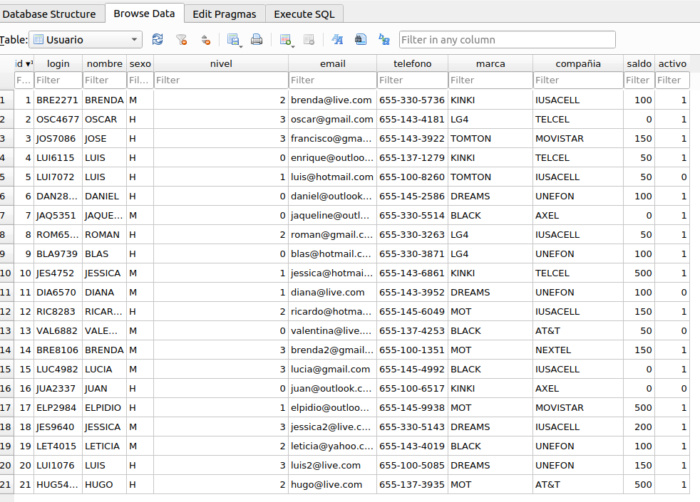

# Simulacro de examen Tarea2

## Creación de la tabla

    CREATE TABLE "Usuario" (
	"id"	INTEGER,
	"login"	TEXT,
	"nombre"	TEXT,
	"sexo"	TEXT,
	"nivel"	INTEGER,
	"email"	TEXT,
	"telefono"	TEXT,
	"marca"	TEXT,
	"compañia"	TEXT,
	"saldo"	INTEGER,
	"activo"	INTEGER,
	PRIMARY KEY("id" AUTOINCREMENT)
);

## Insercciones a la tabla

Se tuvieron que corregir algunas sentencias que tenían errores por ausencia de ';' o uso de ',' en su lugar.

    INSERT INTO Usuario VALUES ('1','BRE2271','BRENDA','M','2','brenda@live.com','655-330-5736','KINKI','IUSACELL','100','1');
    INSERT INTO Usuario  VALUES ('2','OSC4677','OSCAR','H','3','oscar@gmail.com','655-143-4181','LG4','TELCEL','0','1');
    INSERT INTO Usuario  VALUES ('3','JOS7086','JOSE','H','3','francisco@gmail.com','655-143-3922','TOMTON','MOVISTAR','150','1');
    INSERT INTO Usuario  VALUES ('4','LUI6115','LUIS','H','0','enrique@outlook.com','655-137-1279','KINKI','TELCEL','50','1');
    INSERT INTO Usuario  VALUES ('5','LUI7072','LUIS','H','1','luis@hotmail.com','655-100-8260','TOMTON','IUSACELL','50','0');
    INSERT INTO Usuario  VALUES ('6','DAN2832','DANIEL','H','0','daniel@outlook.com','655-145-2586','DREAMS','UNEFON','100','1');
    INSERT INTO Usuario  VALUES ('7','JAQ5351','JAQUELINE','M','0','jaqueline@outlook.com','655-330-5514','BLACK','AXEL','0','1');
    INSERT INTO Usuario  VALUES ('8','ROM6520','ROMAN','H','2','roman@gmail.com','655-330-3263','LG4','IUSACELL','50','1');
    INSERT INTO Usuario  VALUES ('9','BLA9739','BLAS','H','0','blas@hotmail.com','655-330-3871','LG4','UNEFON','100','1');
    INSERT INTO Usuario  VALUES ('10','JES4752','JESSICA','M','1','jessica@hotmail.com','655-143-6861','KINKI','TELCEL','500','1');
    INSERT INTO Usuario  VALUES ('11','DIA6570','DIANA','M','1','diana@live.com','655-143-3952','DREAMS','UNEFON','100','0');
    INSERT INTO Usuario  VALUES ('12','RIC8283','RICARDO','H','2','ricardo@hotmail.com','655-145-6049','MOT','IUSACELL','150','1');
    INSERT INTO Usuario  VALUES ('13','VAL6882','VALENTINA','M','0','valentina@live.com','655-137-4253','BLACK','AT&T','50','0');
    INSERT INTO Usuario  VALUES ('14','BRE8106','BRENDA','M','3','brenda2@gmail.com','655-100-1351','MOT','NEXTEL','150','1');
    INSERT INTO Usuario  VALUES ('15','LUC4982','LUCIA','M','3','lucia@gmail.com','655-145-4992','BLACK','IUSACELL','0','1');
    INSERT INTO Usuario  VALUES ('16','JUA2337','JUAN','H','0','juan@outlook.com','655-100-6517','KINKI','AXEL','0','0');
    INSERT INTO Usuario  VALUES ('17','ELP2984','ELPIDIO','H','1','elpidio@outlook.com','655-145-9938','MOT','MOVISTAR','500','1');
    INSERT INTO Usuario  VALUES ('18','JES9640','JESSICA','M','3','jessica2@live.com','655-330-5143','DREAMS','IUSACELL','200','1');
    INSERT INTO Usuario  VALUES ('19','LET4015','LETICIA','M','2','leticia@yahoo.com','655-143-4019','BLACK','UNEFON','100','1');
    INSERT INTO Usuario  VALUES ('20','LUI1076','LUIS','H','3','luis2@live.com','655-100-5085','DREAMS','UNEFON','150','1');
    INSERT INTO Usuario  VALUES ('21','HUG5441','HUGO','H','2','hugo@live.com','655-137-3935','MOT','AT&T','500','1');

## Consultas

1. Listar los nombres de los usuarios

    select nombre from Usuario;

2. Calcular el saldo máximo de los usuarios de sexo “Mujer”

    select max(saldo) from Usuario where sexo in ('M');

3. Listar nombre y teléfono de los usuarios con teléfono TOMTON, BLACK o DREAMS

    select nombre, telefono from Usuario where marca in ('TOMTON', 'BLACK', 'DREAMS');

4. Contar los usuarios sin saldo o inactivos

    select count(*) from Usuario where saldo=0 or activo=FALSE;

5. Listar el login de los usuarios con nivel 1, 2 o 3

    select login from Usuario where nivel in (1, 2, 3);

6. Listar los números de teléfono con saldo menor o igual a 300

    select telefono from Usuario where saldo>=300;

7. Calcular la suma de los saldos de los usuarios de la compañia telefónica NEXTEL

    select sum(saldo) from Usuario where compañia='NEXTEL';

8. Contar el número de usuarios por compañía telefónica

    select count(*), compañia from Usuario group by compañia;

9. Contar el número de usuarios por nivel

    select count(*), nivel from Usuario group by nivel;

10. Listar el login de los usuarios con nivel 2

    select login from Usuario where nivel=2;

11. Mostrar el email de los usuarios que usan gmail

    select email from usuario where email like '%@gmail%'

12. Listar nombre y teléfono de los usuarios con teléfono LG4, KINKI o MOT

    select nombre, telefono from usuario where marca in ('LG4', 'KINKI', 'MOT')

13. Listar nombre y teléfono de los usuarios con teléfono que no sea de la marca LG4 o KINKI

    select nombre, telefono from usuario where marca not in ('LG4', 'KINKI')

14. Listar el login y teléfono de los usuarios con compañia telefónica IUSACELL

    select login, telefono from usuario where compañia='IUSACELL'

15. Listar el login y teléfono de los usuarios con compañia telefónica que no sea TELCEL

    select login, telefono from usuario where compañia!='IUSACELL'

16. Calcular el saldo promedio de los usuarios que tienen teléfono marca TOMTON

    select avg(saldo) from usuario where marca='TOMTON'

17. Listar el login y teléfono de los usuarios con compañia telefónica IUSACELL o AXEL

    select login, telefono from usuario where compañia in ('IUSACELL', 'AXEL')

18. Mostrar el email de los usuarios que no usan yahoo

    select email from usuario where email not like '%@yahoo%'

19. Listar el login y teléfono de los usuarios con compañia telefónica que no sea TELCEL o IUSACELL

    select login, telefono from usuario where compañia not in ('TELCEL','IUSACELL')

20. Listar el login y teléfono de los usuarios con compañia telefónica UNEFON

    select login, telefono from usuario where compañia='UNEFON'

21. Listar las diferentes marcas de celular en orden alfabético descendentemente

    select DISTINCT marca from usuario order by marca

22. 

23. Listar el login de los usuarios con nivel 0 o 2

    select login  from Usuario where nivel in (0, 2)

24. Calcular el saldo promedio de los usuarios que tienen teléfono marca LG4

    select avg(saldo) from Usuario where marca ='LG4'

25. Listar el login de los usuarios con nivel 1 o 3

    select login from Usuario where nivel in (1, 3)

26. Listar nombre y teléfono de los usuarios con teléfono que no sea de la marca BLACK

    select nombre, telefono from Usuario where marca!='BLACK'

27. Listar el login de los usuarios con nivel 3

    select login from Usuario where nivel=3

28. Listar el login de los usuarios con nivel 0

    select login from Usuario where nivel=0

29. Listar el login de los usuarios con nivel 1

    select login from Usuario where nivel=1

30. Contar el número de usuarios por sexo
    
    select count(*) from Usuario group by sexo

31. Listar el login y teléfono de los usuarios con compañia telefónica AT&T

    select login, telefono from Usuario where compañia='AT&T'

### hasta aquí lo que me dio tiempo a hacer en simulacro

32. Listar las diferentes compañias en orden alfabético descendentemente

    select distinct compañia from usuario order by compañia desc;  

33. Listar el login de los usuarios inactivos

    select login from Usuario where activo=FALSE;  

34. Listar los números de teléfono sin saldo

    select telefono from Usuario where saldo=0; 

35. Calcular el saldo mínimo de los usuarios de sexo “Hombre”

    select min(Usuario) from Usuario where sexo='M';

36. Listar los números de teléfono con saldo mayor a 300

    select telefono from Usuario where saldo>300;