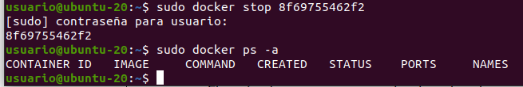

# Introducción a Docker

## Creación de un contenedor Docker con MySQL Server

### 1. Primero compruebo que tengo Docker instalado en la máquina:

Lo instalo:
    

### 2. Cómo crear un contenedor sin persistencia de datos

    docker run -d --rm --name mysql -e MYSQL_ROOT_PASSWORD=root -p 3306:3306 mysql:8.0

Obtengo un error por conflictos en el puerto asignado:

Compruebo que no esté mysql.service corriendo:

Efectivamente, ese es el problema. Detengo el servicio y lanzo de nuevo el comando.

Ahora no hay conflicto y el contenedor se genera sin problemas.

### 3. Cómo crear un contenedor con persistencia de datos

Primero detengo el contenedor actual que, como no era persistente, no deja información almacenada.

Ahora genero un nuevo contenedor que sea persistente, para ello utilizo el modificador -v:

    docker run -d --rm --name mysql -e MYSQL_ROOT_PASSWORD=root -p 3306:3306 -v mysql_data:/var/lib/mysql mysql:8.0

### 4. Ejemplo de docker-compose.yml con MySQL Server

Creo un fichero YAML:

Ahora puedo 'levantar' el contenedor desde el fichero YAML:

Para 'bajarlo':

Si quisieramos eliminar el volumen asociado:

    sudo docker-compose down -v

