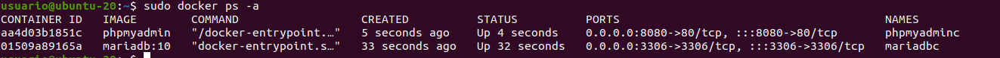

# Creación de un contenedor Docker con phpMyAdmin y enlace con un contenedor MySql

## 1. Creo el contenedor de MySql

    sudo docker run -d \
    --rm \
    --name mysqlc \
    -p 3306:3306 \
    -e MYSQL_ROOT_PASSWORD=root \
    -v mysql_data:/var/lib/mysql \
    mysql:8.0

## 2. Creo el contenedor de phpMyAdmin

    sudo docker run -d \
    --rm \
    --name phpmyadminc \
    --link mysqlc \
    -e PMA_HOST=mysqlc \
    -p 8080:80 \
    phpmyadmin

Los contenedores están creados y conectados:

Utilizando el puerto puedo conectarme al cliente:

#  Conexión de los contenedores mediante una red

## 1. Creamos nuestra 'bridge-network'

    sudo docker network create my-net

## 2. Volvemos a crear los contenedores, conectándolos a la red

    sudo docker run -d \
    --rm \
    --name mysqlc \
    --network my-net \
    -p 3306:3306 \
    -e MYSQL_ROOT_PASSWORD=root \
    -v mysql_data:/var/lib/mysql \
    mysql:8.0

    sudo docker run -d \
    --rm \
    --name phpmyadminc \
    --network my-net \
    -e PMA_HOST=mysqlc \
    -p 8080:80 \
    phpmyadmin

## 3. Repetir proceso para MariaDB

### 1. Mediante enlace

    sudo docker run -d \
    --rm \
    --name mariadbc \
    -p 3306:3306 \
    -e MYSQL_ROOT_PASSWORD=root \
    -v mariadb_data:/var/lib/mysql \
    mariadb:10

    sudo docker run -d \
    --rm \
    --name phpmyadminc \
    --link mariadbc \
    -e PMA_HOST=mariadbc \
    -p 8080:80 \
    phpmyadmin

### 2. Mediante subred

Uso la misma red del caso anterior.

    sudo docker run -d \
    --rm \
    --name mariadbc \
    --network my-net \
    -p 3306:3306 \
    -e MYSQL_ROOT_PASSWORD=root \
    -v mariadb_data:/var/lib/mysql \
    mariadb:10

    sudo docker run -d \
    --rm \
    --name phpmyadminc \
    --network my-net \
    -e PMA_HOST=mariadbc \
    -p 8080:80 \
    phpmyadmin

