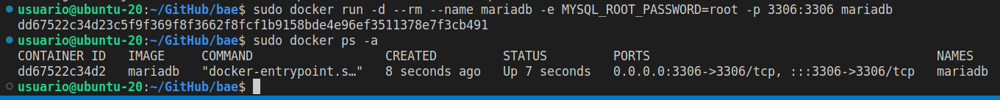
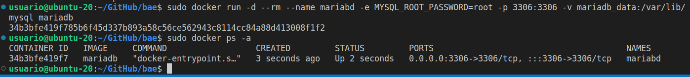
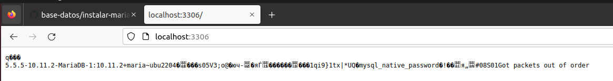

# Introducción a Docker

## Creación de un contenedor Docker con MariaDB

### 1. Cómo crear un contenedor sin persistencia de datos

    sudo docker run -d --rm --name mariadb -e MYSQL_ROOT_PASSWORD=root -p 3306:3306 mariadb

### 2. Crear un contenedor con persistencia de datos

Usando el comando -v generamos un volumen en la máquina para guardar los datos del contenedor:

    docker run -d --rm --name mariabd -e MYSQL_ROOT_PASSWORD=root -p 3306:3306 -v mariadb_data:/var/lib/mysql mariadb

Si tuviese un cliente instalado pordría conectarme utilizando el puerto definido:

    Host: 127.0.0.1
    Puerto: 3306
    Usuario: root
    Password: root

