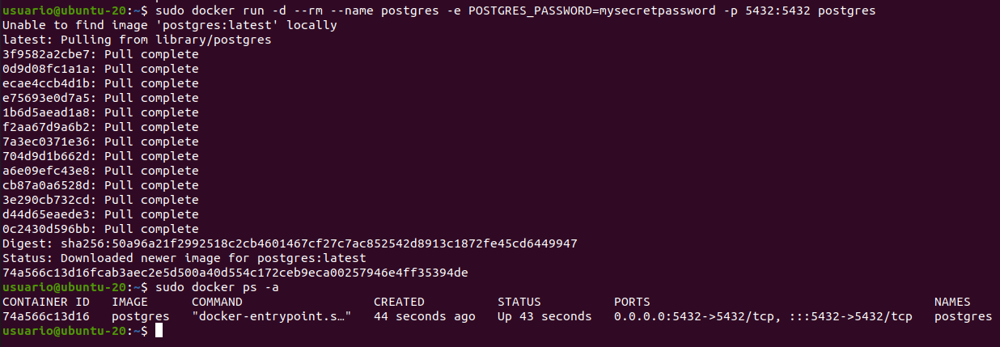
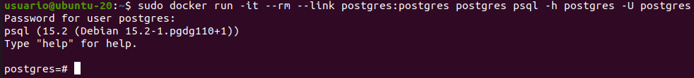
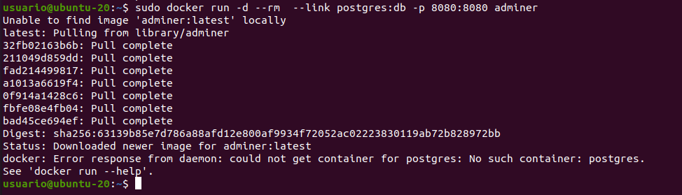
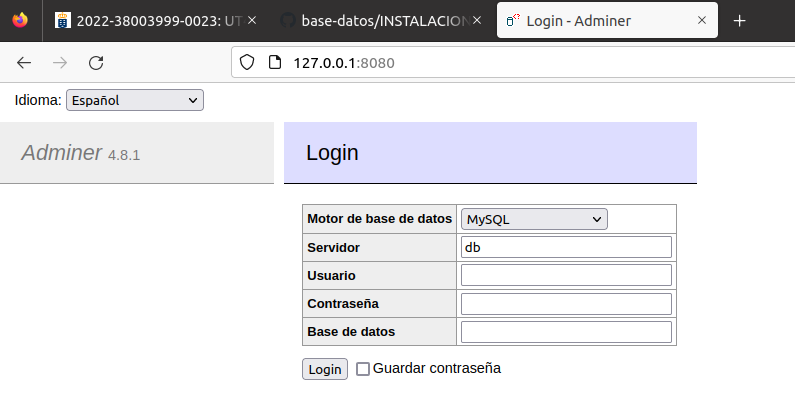

# Creación de un contenedor Docker con PostgreSQL

Para crear un contenedor sin persistencia:

    docker run -d --rm --name postgres -e           POSTGRES_PASSWORD=mysecretpassword -p 5432:5432 postgres

# Cómo conectarnos con el contenedor que está ejecutando PostgreSQL usando psql

Para conectarnos al contenedor usando psql:

    sudo docker run -it --rm --link postgres:postgres postgres psql -h postgres -U postgres

Para conectarnos al contenedor usando adminer:

    sudo docker run -d --rm  --link postgres:db -p 8080:8080 adminer

 

Lo que ocurre es que no está ejecutandose postgresql. Creo el contenedor de postgres y luego creo el de adminer:

# Acceso a Adminer:

Ahora puedo conectarme utilizando la url:

