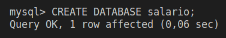
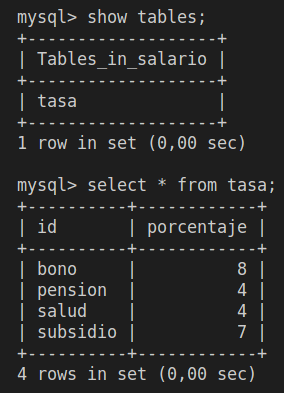
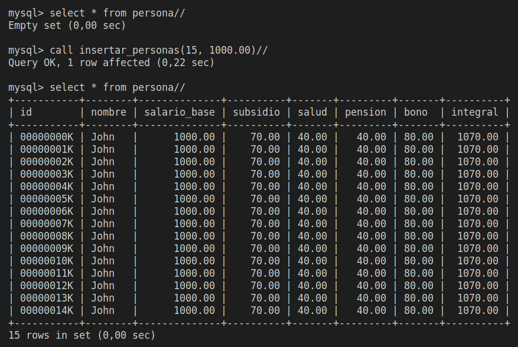
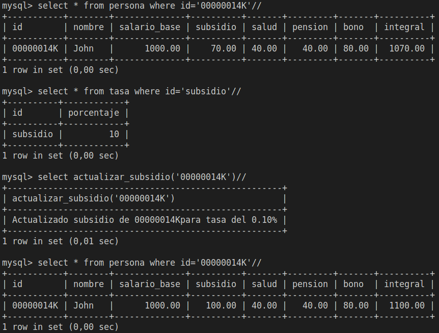
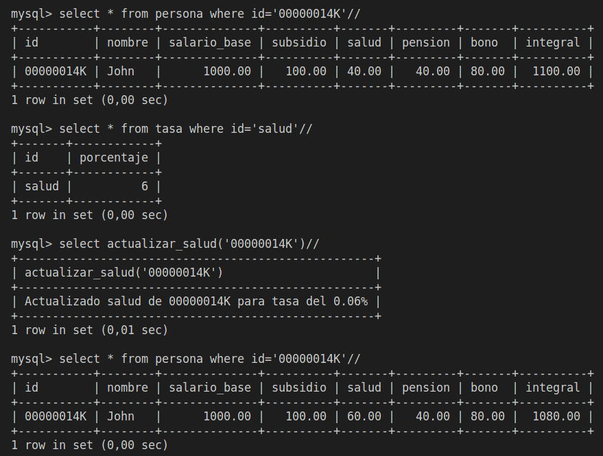
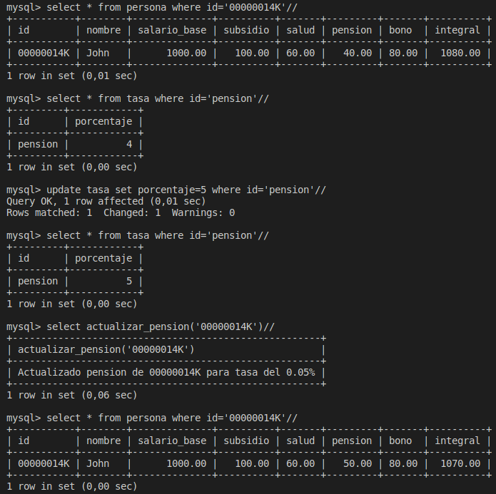
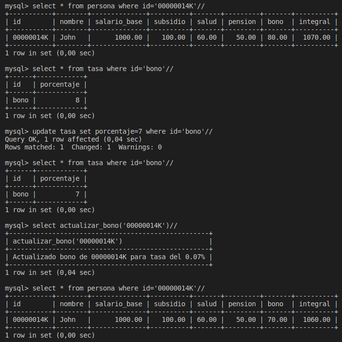

# Salarios

## Crea una base datos llamada salario

    CREATE DATABASE salario;

    
## Crea una tabla que se llame persona

    USE salario;
    DROP TABLE IF EXISTS tasa;
    CREATE TABLE tasa(
        id VARCHAR(20) PRIMARY KEY,
        porcentaje TINYINT
    );
    INSERT INTO tasa VALUES ('subsidio', 7);
    INSERT INTO tasa VALUES ('salud', 4);
    INSERT INTO tasa VALUES ('pension', 4);
    INSERT INTO tasa VALUES ('bono', 8);

    DROP TABLE IF EXISTS persona;
    CREATE TABLE persona(
        id VARCHAR(9) PRIMARY KEY,
        nombre VARCHAR(20),
        salario_base FLOAT(9,2),
        subsidio FLOAT(9,2), 
        salud FLOAT(9,2),
        pension FLOAT(9,2),
        bono FLOAT(9,2),
        integral FLOAT(9,2) AS (salario_base - salud - pension + bono + subsidio)
    );

## Realiza almenos 10 insert en la tabla
    
    DELIMITER //
    DROP PROCEDURE IF EXISTS insertar_personas//
    CREATE PROCEDURE insertar_personas(IN inserts_pedidos SMALLINT, IN salario_base FLOAT(9,2))
    BEGIN 
        DECLARE new_id VARCHAR(8);
        DECLARE insertados TINYINT DEFAULT 0;
        DECLARE tasa_subsidio FLOAT(4, 2);
        DECLARE tasa_salud FLOAT(4, 2);
        DECLARE tasa_pension FLOAT(4, 2); 
        DECLARE tasa_bono FLOAT(4, 2);   
        SET tasa_subsidio = (SELECT porcentaje FROM tasa WHERE id='subsidio') / 100;
        SET tasa_salud = (SELECT porcentaje FROM tasa WHERE id='salud') / 100;
        SET tasa_pension = (SELECT porcentaje FROM tasa WHERE id='pension') / 100;
        SET tasa_bono = (SELECT porcentaje FROM tasa WHERE id='bono') / 100;
        IF (SELECT EXISTS(SELECT id FROM persona)) THEN
           SET new_id = (SELECT SUBSTRING(id, 1, 8) AS id_number FROM persona ORDER BY id_number DESC LIMIT 1) + 1;
           SET new_id = LPAD(new_id, 8, 0);
        ELSE
            SET new_id = '00000000';
        END IF;
        WHILE insertados < inserts_pedidos DO 
            INSERT INTO persona (id, nombre, salario_base, subsidio, salud, pension, bono)
            VALUES (
                CONCAT(new_id, 'K'), 
                'John', 
                salario_base,
                salario_base * tasa_subsidio,
                salario_base * tasa_salud,
                salario_base * tasa_pension,
                salario_base * tasa_bono
                );
            SET new_id = new_id + 1;
            SET new_id = LPAD(new_id, 8, 0);
            SET insertados = insertados + 1;
        END WHILE; 
    END
    //

## Cree las siguientes funciones

 

### 1. Función subsidio_transporte

    DELIMITER //
    DROP FUNCTION IF EXISTS actualizar_subsidio//
    CREATE FUNCTION actualizar_subsidio(id_persona VARCHAR(9)) 
    RETURNS VARCHAR(60)
    DETERMINISTIC 
    BEGIN
        DECLARE tasa_subsidio FLOAT(4, 2);
        SET tasa_subsidio = (SELECT porcentaje FROM tasa WHERE id="subsidio") / 100;
        UPDATE persona SET subsidio = salario_base * tasa_subsidio WHERE id=id_persona;
        RETURN CONCAT('Actualizado subsidio de ', id_persona, ' para tasa del ', tasa_subsidio, '%');
    END
    //

 

### 2. Función salud

    DELIMITER //
    DROP FUNCTION IF EXISTS actualizar_salud//
    CREATE FUNCTION actualizar_salud(id_persona VARCHAR(9)) 
    RETURNS VARCHAR(60)
    DETERMINISTIC 
    BEGIN
        DECLARE tasa_salud FLOAT(4, 2);
        SET tasa_salud = (SELECT porcentaje FROM tasa WHERE id="salud") / 100;
        UPDATE persona SET salud = salario_base * tasa_salud WHERE id=id_persona;
        RETURN CONCAT('Actualizado salud de ', id_persona, ' para tasa del ', tasa_salud, '%');
    END
    //

 

### 3. Función pension

    DELIMITER //
    DROP FUNCTION IF EXISTS actualizar_pension//
    CREATE FUNCTION actualizar_pension(id_persona VARCHAR(9)) 
    RETURNS VARCHAR(60)
    DETERMINISTIC 
    BEGIN
        DECLARE tasa_pension FLOAT(4, 2);
        SET tasa_pension = (SELECT porcentaje FROM tasa WHERE id="pension") / 100;
        UPDATE persona SET pension = salario_base * tasa_pension WHERE id=id_persona;
        RETURN CONCAT('Actualizado pension de ', id_persona, ' para tasa del ', tasa_pension, '%');
    END
    //

 

### 4. Función bono: Un bono que corresponde al 8% al salario básico.

    DELIMITER //
    DROP FUNCTION IF EXISTS actualizar_bono//
    CREATE FUNCTION actualizar_bono(id_persona VARCHAR(9)) 
    RETURNS VARCHAR(60)
    DETERMINISTIC 
    BEGIN
        DECLARE tasa_bono FLOAT(4, 2);
        SET tasa_bono = (SELECT porcentaje FROM tasa WHERE id="bono") / 100;
        UPDATE persona SET bono = salario_base * tasa_bono WHERE id=id_persona;
        RETURN CONCAT('Actualizado bono de ', id_persona, ' para tasa del ', tasa_bono, '%');
    END
    //

 

### 5. Función integral

El valor de 'integral' se calcula en función de los valores de los campos correspondientes de la tupla.

### 6. Actualizar todas las personas

    DELIMITER //
    DROP PROCEDURE IF EXISTS actualizar_todos//
    CREATE PROCEDURE actualizar_todos()
    BEGIN
        DECLARE id_actual VARCHAR(9);
        DECLARE numero_personas SMALLINT;
        DECLARE actualizados SMALLINT;
        SET numero_personas = (SELECT COUNT(id) FROM persona);
        IF numero_personas > 0 THEN
            SET actualizados = 0;
            WHILE actualizados < numero_personas DO
                SET id_actual =  (SELECT id FROM persona ORDER BY id LIMIT actualizados, 1);
                SELECT actualizar_subsidio(id_actual);
                SELECT actualizar_salud(id_actual);
                SELECT actualizar_pension(id_actual);
                SELECT actualizar_bono(id_actual);
                SET actualizados = actualizados + 1;
            END WHILE;
        END IF;
    END
    //