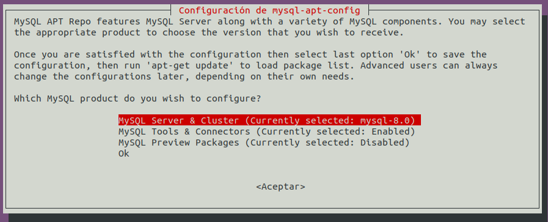
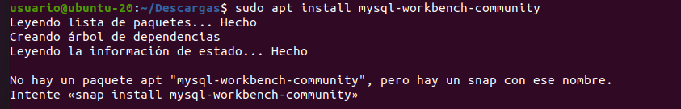
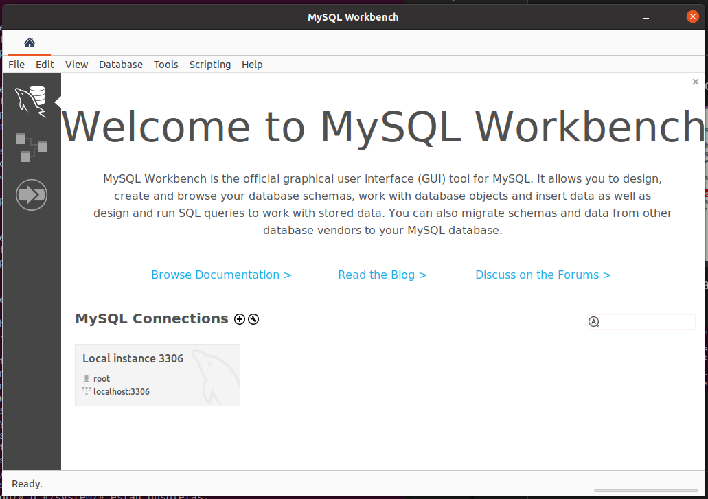
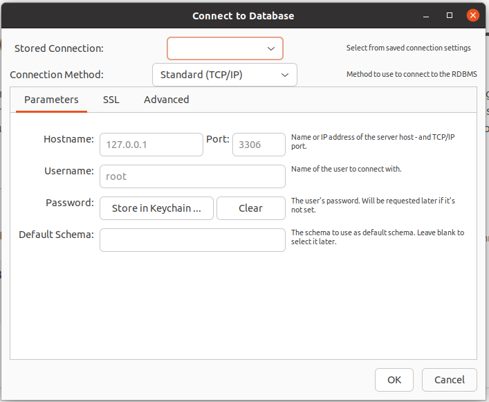

# INSTALACION Y CONFIGURACION DE MYSQL

## Instalación

### Paso 1: Instalación 

    sudo apt update
    sudo apt install mysql-server
    sudo su
    mysql -u root
    exit

Con esta secuencia de comandos instalamos mysql-server desde el repositorio de la distribución, lo ejecutamos como superusuario y lo cerramos.

### Paso 2: Configuración

    sudo mysql_secure_installation

root@ubuntu-20:/home/usuario# mysql_secure_installation

Securing the MySQL server deployment.

Connecting to MySQL using a blank password.

VALIDATE PASSWORD COMPONENT can be used to test passwords
and improve security. It checks the strength of password
and allows the users to set only those passwords which are
secure enough. Would you like to setup VALIDATE PASSWORD component?

Press y|Y for Yes, any other key for No: y

There are three levels of password validation policy:

LOW    Length >= 8
MEDIUM Length >= 8, numeric, mixed case, and special characters
STRONG Length >= 8, numeric, mixed case, special characters and dictionary                  file

Please enter 0 = LOW, 1 = MEDIUM and 2 = STRONG: 1
Please set the password for root here.

New password: 

Re-enter new password: 

Estimated strength of the password: 100 
Do you wish to continue with the password provided?(Press y|Y for Yes, any other key for No) : y
 ... Failed! Error: SET PASSWORD has no significance for user 'root'@'localhost' as the authentication method used doesn't store authentication data in the MySQL server. Please consider using ALTER USER instead if you want to change authentication parameters.

Para solucionar este problema tenemos que configurar el usuario root y usarlo para ejecutar mysql.

     ALTER USER 'root'@'localhost' IDENTIFIED WITH mysql_native_password by 'mynewpassword';
     sudo mysql_secure_installation

Una vez realizados estos pasos continúo con el script de instalación segura, deshabilitando los usuarios anónimos.

Remove anonymous users? (Press y|Y for Yes, any other key for No) : y
Success.

### Paso 3: Ajustar la autenticación y los privilegios de usuario

Compruebo el método de autenticación de cada una de mis cuentas:

    sudo mysql
    SELECT user,authentication_string,plugin,host FROM mysql.user;

+------------------+------------------------------------------------------------------------+-----------------------+-----------+
| user             | authentication_string                                                  | plugin                | host      |
+------------------+------------------------------------------------------------------------+-----------------------+-----------+
| debian-sys-maint | $A$005$�0sPixqX3*=I.]i/kIzOBZk3vISm.Ln4g0bYUBTEj/jtAIYynt3gEPiAi32     | caching_sha2_password | localhost |
| mysql.infoschema | $A$005$THISISACOMBINATIONOFINVALIDSALTANDPASSWORDTHATMUSTNEVERBRBEUSED | caching_sha2_password | localhost |
| mysql.session    | $A$005$THISISACOMBINATIONOFINVALIDSALTANDPASSWORDTHATMUSTNEVERBRBEUSED | caching_sha2_password | localhost |
| mysql.sys        | $A$005$THISISACOMBINATIONOFINVALIDSALTANDPASSWORDTHATMUSTNEVERBRBEUSED | caching_sha2_password | localhost |
| root             | *953BFEE1040C378D7690B7C249D324E572405B99                              | mysql_native_password | localhost |
+------------------+------------------------------------------------------------------------+-----------------------+-----------+
5 rows in set (0,00 sec)

Si quisieramos aplicar los cambios en caliente:

    FLUSH PRIVILEGES;

Creamos un nuevo usuario con su contraseña:

    CREATE USER 'sammy'@'localhost' IDENTIFIED BY 'password';

mysql> CREATE USER 'javigh'@'localhost' IDENTIFIED BY '+++++++';
Query OK, 0 rows affected (0,01 sec)

Le damos privilegios para acceder a las tablas:

    GRANT ALL PRIVILEGES ON *.* TO 'javigh'@'localhost' WITH GRANT OPTION;

mysql> GRANT ALL PRIVILEGES ON *.* TO 'javigh'@'localhost' WITH GRANT OPTION;
Query OK, 0 rows affected (0,01 sec)

### Paso 4: Probar MySQL

Comprobación de que MySQL se ejecuta automáticamente:

    systemctl status mysql.service

usuario@ubuntu-20:~$ systemctl status mysql.service
● mysql.service - MySQL Community Server
     Loaded: loaded (/lib/systemd/system/mysql.service; enabled; vendor preset: enabled)
     Active: active (running) since Wed 2023-03-08 15:29:02 UTC; 43min ago
   Main PID: 947 (mysqld)
     Status: "Server is operational"
      Tasks: 38 (limit: 4619)
     Memory: 315.0M
     CGroup: /system.slice/mysql.service
             └─947 /usr/sbin/mysqld

Si no estuviese ejecutándose, se podría iniciar con:

    sudo systemctl start mysql

Como comprobación adicional intento establecer conexión con la base de datos:

    sudo mysqladmin -p -u root version

usuario@ubuntu-20:~$ sudo mysqladmin -p -u root version
Enter password: 
mysqladmin  Ver 8.0.32-0ubuntu0.20.04.2 for Linux on x86_64 ((Ubuntu))
Copyright (c) 2000, 2023, Oracle and/or its affiliates.

Oracle is a registered trademark of Oracle Corporation and/or its
affiliates. Other names may be trademarks of their respective
owners.

Server version		8.0.32-0ubuntu0.20.04.2
Protocol version	10
Connection		Localhost via UNIX socket
UNIX socket		/var/run/mysqld/mysqld.sock
Uptime:			46 min 53 sec

Threads: 2  Questions: 2  Slow queries: 0  Opens: 119  Flush tables: 3  Open tables: 38  Queries per second avg: 0.000

## Creación de usuarios
 
Creación del usuario:

    CREATE USER 'newuser'@'localhost' IDENTIFIED BY 'password';

Concesión de privilegios:

    GRANT ALL PRIVILEGES ON * . * TO 'newuser'@'localhost';

Para cargar los privilegios:

    FLUSH PRIVILEGES;

Compruebo mis privilegios actuales como usuario:

    SHOW GRANTS FOR 'javigh'@'localhost';

mysql> SHOW GRANTS FOR 'javigh'@'localhost';
+----------------------------------------------------------------------------------------------------------------------------------------------------------------------------------------------------------------------------------------------------------------------------------------------------------------------------------------------------------------------------------------------------------------------------------------------------------------------------------------------------------------------------------------------------------------------------------------------------------------------------------------------------------------------------------------------------------------------------------------------------------------------------+
| Grants for javigh@localhost                                                                                                                                                                                                                                                                                                                                                                                                                                                                                                                                                                                                                                                                                                                                                |
+----------------------------------------------------------------------------------------------------------------------------------------------------------------------------------------------------------------------------------------------------------------------------------------------------------------------------------------------------------------------------------------------------------------------------------------------------------------------------------------------------------------------------------------------------------------------------------------------------------------------------------------------------------------------------------------------------------------------------------------------------------------------------+
| GRANT SELECT, INSERT, UPDATE, DELETE, CREATE, DROP, RELOAD, SHUTDOWN, PROCESS, FILE, REFERENCES, INDEX, ALTER, SHOW DATABASES, SUPER, CREATE TEMPORARY TABLES, LOCK TABLES, EXECUTE, REPLICATION SLAVE, REPLICATION CLIENT, CREATE VIEW, SHOW VIEW, CREATE ROUTINE, ALTER ROUTINE, CREATE USER, EVENT, TRIGGER, CREATE TABLESPACE, CREATE ROLE, DROP ROLE ON *.* TO `javigh`@`localhost` WITH GRANT OPTION                                                                                                                                                                                                                                                                                                                                                                 |
| GRANT APPLICATION_PASSWORD_ADMIN,AUDIT_ABORT_EXEMPT,AUDIT_ADMIN,AUTHENTICATION_POLICY_ADMIN,BACKUP_ADMIN,BINLOG_ADMIN,BINLOG_ENCRYPTION_ADMIN,CLONE_ADMIN,CONNECTION_ADMIN,ENCRYPTION_KEY_ADMIN,FIREWALL_EXEMPT,FLUSH_OPTIMIZER_COSTS,FLUSH_STATUS,FLUSH_TABLES,FLUSH_USER_RESOURCES,GROUP_REPLICATION_ADMIN,GROUP_REPLICATION_STREAM,INNODB_REDO_LOG_ARCHIVE,INNODB_REDO_LOG_ENABLE,PASSWORDLESS_USER_ADMIN,PERSIST_RO_VARIABLES_ADMIN,REPLICATION_APPLIER,REPLICATION_SLAVE_ADMIN,RESOURCE_GROUP_ADMIN,RESOURCE_GROUP_USER,ROLE_ADMIN,SENSITIVE_VARIABLES_OBSERVER,SERVICE_CONNECTION_ADMIN,SESSION_VARIABLES_ADMIN,SET_USER_ID,SHOW_ROUTINE,SYSTEM_USER,SYSTEM_VARIABLES_ADMIN,TABLE_ENCRYPTION_ADMIN,XA_RECOVER_ADMIN ON *.* TO `javigh`@`localhost` WITH GRANT OPTION |
+----------------------------------------------------------------------------------------------------------------------------------------------------------------------------------------------------------------------------------------------------------------------------------------------------------------------------------------------------------------------------------------------------------------------------------------------------------------------------------------------------------------------------------------------------------------------------------------------------------------------------------------------------------------------------------------------------------------------------------------------------------------------------+
2 rows in set (0,00 sec)

Si quisiera eliminar un usuario:

    DROP USER 'username'@'localhost';

Deslogueo e intento acceder con el nuevo usuario:

    mysql -u javigh -p

usuario@ubuntu-20:~/GitHub/bae$ mysql -u javigh -p
Enter password: 
Welcome to the MySQL monitor.  Commands end with ; or \g.
Your MySQL connection id is 16
Server version: 8.0.32-0ubuntu0.20.04.2 (Ubuntu)

Copyright (c) 2000, 2023, Oracle and/or its affiliates.

Oracle is a registered trademark of Oracle Corporation and/or its
affiliates. Other names may be trademarks of their respective
owners.

## Instalación de MySQL WorkBench

### Paso 1: Instalación

Agrego el repositorio oficial de mysql:

    
Cuando intento instalar me dice que no encuentra el paquete, pero que sí un snap:

Lo instalo.

### Paso 2: Configuración de una conexión con la base de datos

Lanzo el programa:

En 'Database' > 'Connect to database' puedo configurar una conexión a una base de datos y guardarla para poder reutilizarla cuando quiera.

