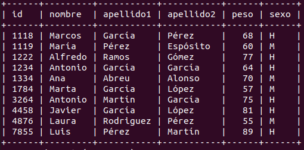
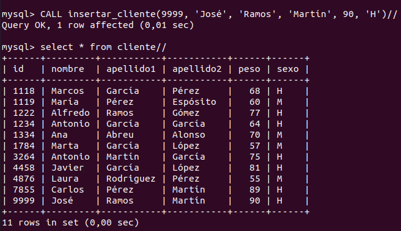
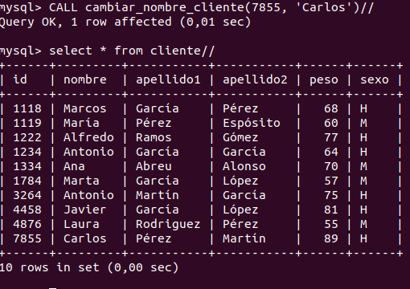
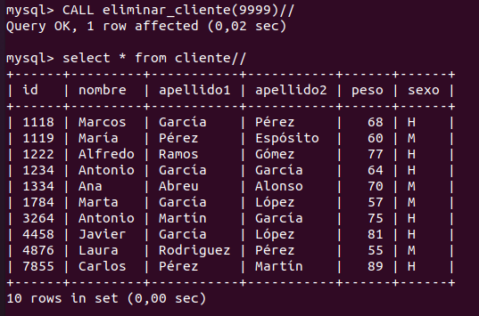
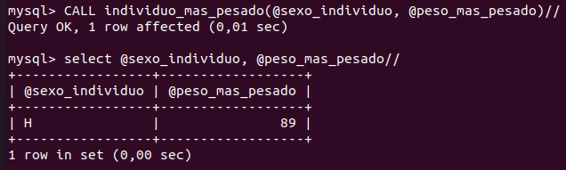
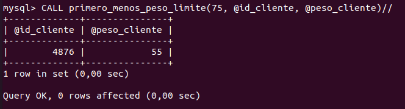

# Gestión de Clientes

## Crea una base datos llamada clientes

    CREATE DATABASE clientes;
    
## Crea una tabla que se llame persona

    USE clientes;
    DROP TABLE IF EXISTS cliente;
    CREATE TABLE cliente(
        id SMALLINT UNSIGNED PRIMARY KEY,
        nombre VARCHAR(20),
        apellido1 VARCHAR(20),
        apellido2 VARCHAR(20),
        peso SMALLINT UNSIGNED,
        sexo ENUM('H', 'M')
    );

## Realiza almenos 10 insert en la tabla

    INSERT INTO cliente VALUES (1234, 'Antonio', 'García', 'García', 64, 'H');
    INSERT INTO cliente VALUES (1784, 'Marta', 'García', 'López', 57, 'M');
    INSERT INTO cliente VALUES (1222, 'Alfredo', 'Ramos', 'Gómez', 77, 'H');
    INSERT INTO cliente VALUES (1118, 'Marcos', 'García', 'Pérez', 68, 'H');
    INSERT INTO cliente VALUES (4876, 'Laura', 'Rodriguez', 'Pérez', 55, 'M');
    INSERT INTO cliente VALUES (7855, 'Luis', 'Pérez', 'Martín', 89, 'H');
    INSERT INTO cliente VALUES (4458, 'Javier', 'García', 'López', 81, 'H');
    INSERT INTO cliente VALUES (3264, 'Antonio', 'Martín', 'García', 75, 'H');
    INSERT INTO cliente VALUES (1119, 'María', 'Pérez', 'Espósito', 60, 'M');
    INSERT INTO cliente VALUES (1334, 'Ana', 'Abreu', 'Alonso', 70, 'M');

## Cree los siguientes procedimientos

### 1. Insertar información en la tabla clientes.

    DELIMITER //
    DROP PROCEDURE IF EXISTS insertar_cliente
    //
    CREATE PROCEDURE insertar_cliente(
                                        IN nueva_id SMALLINT UNSIGNED, 
                                        IN nuevo_nombre VARCHAR(20),
                                        IN nuevo_apellido1 VARCHAR(20),
                                        IN nuevo_apellido2 VARCHAR(20),
                                        IN peso SMALLINT UNSIGNED,
                                        IN sexo ENUM('H', 'M')
                                    )
    BEGIN
        INSERT INTO cliente VALUES (
                                        nueva_id, 
                                        nuevo_nombre, 
                                        nuevo_apellido1,
                                        nuevo_apellido2,
                                        peso,
                                        sexo
                                    );
    END
    //

### 2. Que actualice el nombre de un cliente

    DELIMITER //
    DROP PROCEDURE IF EXISTS cambiar_nombre_cliente
    //
    CREATE PROCEDURE cambiar_nombre_cliente(IN id_cliente SMALLINT UNSIGNED, IN nuevo_nombre VARCHAR(20))
    BEGIN
        UPDATE cliente SET nombre = nuevo_nombre WHERE id = id_cliente;
    END
    //

### 3. Que elimine un cliente

    DELIMITER //
    DROP PROCEDURE IF EXISTS eliminar_cliente
    //
    CREATE PROCEDURE eliminar_cliente(IN id_cliente SMALLINT UNSIGNED)
    BEGIN
        DELETE FROM cliente WHERE id = id_cliente;
    END
    //

### 4. Ejemplo de procedimiento con parámetro de salida

Por ejemplo, la mujer o el hombre que más pese.

    DELIMITER //
    DROP PROCEDURE IF EXISTS individuo_mas_pesado
    //
    CREATE PROCEDURE individuo_mas_pesado(
                                            INOUT sexo_individuo ENUM('H', 'M'), 
                                            OUT peso_individuo SMALLINT UNSIGNED
                                         )
    BEGIN 
        SELECT max(peso) INTO peso_individuo
        FROM cliente GROUP BY sexo HAVING sexo = sexo_individuo;
    END
    // 

### 5. Ejemplo con while

Por ejemplo, ir mirando los clientes ordenados por peso, hasta encontrar el primero que pese menos de 50 kg.

    DELIMITER //
    DROP PROCEDURE IF EXISTS primero_menos_peso_limite
    //
    CREATE PROCEDURE primero_menos_peso_limite(
                                            IN peso_limite SMALLINT, 
                                            OUT id_cliente SMALLINT UNSIGNED, 
                                            OUT peso_cliente SMALLINT UNSIGNED
                                        )    
    BEGIN 
        DECLARE puntero SMALLINT UNSIGNED DEFAULT 0;
        SET peso_cliente = peso_limite;
        WHILE peso_cliente >= peso_limite DO 
            SELECT id, peso INTO id_cliente, peso_cliente 
            FROM cliente ORDER BY peso LIMIT 1 OFFSET puntero;
            SET puntero = puntero + 1;
        END WHILE;
        SELECT @id_cliente, @peso_cliente;
    END
    // 

