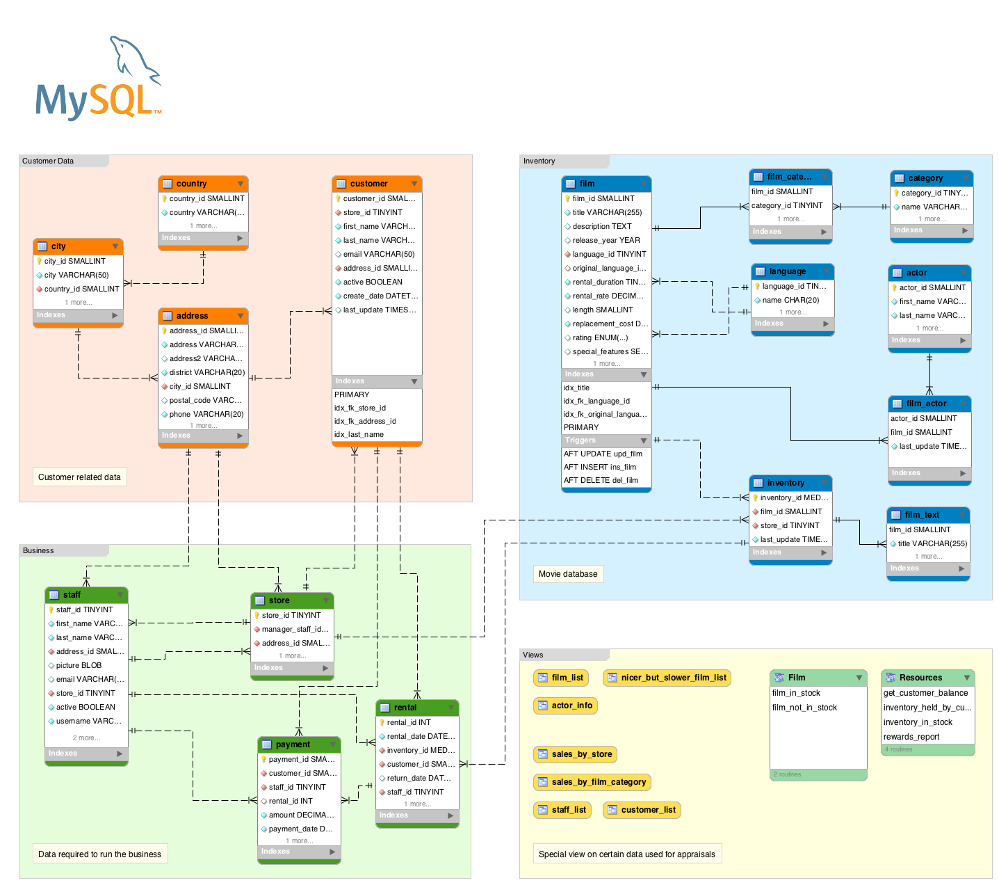

# Tarea 1 

## Trabajo con 'Sakila'

Trabajaremos con una base de datos proporcionada por MySql: 'Sakila'.

Para generar la base de datos:

~~~~sql
mysql> SOURCE ~/GitHub/bae/vistas_indices/sakila-db/sakila-schema.sql;
mysql> SOURCE ~/GitHub/bae/vistas_indices/sakila-db/sakila-data.sql;
mysql> use sakila
Database changed
mysql> SHOW FULL TABLES;

+----------------------------+------------+
| Tables_in_sakila           | Table_type |
+----------------------------+------------+
| actor                      | BASE TABLE |
| actor_info                 | VIEW       |
| address                    | BASE TABLE |
| category                   | BASE TABLE |
| city                       | BASE TABLE |
| country                    | BASE TABLE |
| customer                   | BASE TABLE |
| customer_list              | VIEW       |
| film                       | BASE TABLE |
| film_actor                 | BASE TABLE |
| film_category              | BASE TABLE |
| film_list                  | VIEW       |
| film_text                  | BASE TABLE |
| inventory                  | BASE TABLE |
| language                   | BASE TABLE |
| nicer_but_slower_film_list | VIEW       |
| payment                    | BASE TABLE |
| rental                     | BASE TABLE |
| sales_by_film_category     | VIEW       |
| sales_by_store             | VIEW       |
| staff                      | BASE TABLE |
| staff_list                 | VIEW       |
| store                      | BASE TABLE |
+----------------------------+------------+

23 rows in set (0,00 sec)

mysql> SELECT COUNT(*) FROM film_text;
+----------+
| COUNT(*) |
+----------+
|     1000 |
+----------+
1 row in set (0,02 sec)

mysql> SELECT COUNT(*) FROM film;
+----------+
| COUNT(*) |
+----------+
|     1000 |
+----------+
1 row in set (0,01 sec)
~~~~

## Consultas 

1. Actores que tienen de primer nombre Scarlett.

~~~~sql
mysql> select * from actor where first_name='Scarlett';
+----------+------------+-----------+---------------------+
| actor_id | first_name | last_name | last_update         |
+----------+------------+-----------+---------------------+
|       81 | SCARLETT   | DAMON     | 2006-02-15 04:34:33 |
|      124 | SCARLETT   | BENING    | 2006-02-15 04:34:33 |
+----------+------------+-----------+---------------------+
2 rows in set (0,00 sec)
~~~~

2. Actores que tienen de apellido Johansson.

~~~~sql
mysql> select * from actor where last_name='Johansson';
+----------+------------+-----------+---------------------+
| actor_id | first_name | last_name | last_update         |
+----------+------------+-----------+---------------------+
|        8 | MATTHEW    | JOHANSSON | 2006-02-15 04:34:33 |
|       64 | RAY        | JOHANSSON | 2006-02-15 04:34:33 |
|      146 | ALBERT     | JOHANSSON | 2006-02-15 04:34:33 |
+----------+------------+-----------+---------------------+
3 rows in set (0,00 sec)
~~~~

3. Actores que contengan una O en su nombre.

~~~~sql
mysql> select * from actor where first_name regexp('o|O');
+----------+-------------+--------------+---------------------+
| actor_id | first_name  | last_name    | last_update         |
+----------+-------------+--------------+---------------------+
|        1 | PENELOPE    | GUINESS      | 2006-02-15 04:34:33 |
|        5 | JOHNNY      | LOLLOBRIGIDA | 2006-02-15 04:34:33 |
...
mysql> select count(*) from actor where first_name regexp('o|O');
+----------+
| count(*) |
+----------+
|       36 |
+----------+
1 row in set (0,00 sec)
~~~~

4. Actores que contengan una O en su nombre y en una A en su apellido.

~~~~sql
mysql> select count(*) from actor where first_name regexp('o|O') and last_name regexp('A|a');
+----------+
| count(*) |
+----------+
|       16 |
+----------+
1 row in set (0,00 sec)

mysql> select * from actor where first_name regexp('o|O') and last_name regexp('A|a');
+----------+------------+--------------+---------------------+
| actor_id | first_name | last_name    | last_update         |
+----------+------------+--------------+---------------------+
|        5 | JOHNNY     | LOLLOBRIGIDA | 2006-02-15 04:34:33 |
|        9 | JOE        | SWANK        | 2006-02-15 04:34:33 |
...
~~~~

5. Actores que contengan dos O en su nombre y en una A en su apellido.

~~~~sql
mysql> select * from actor where first_name regexp('.*[oO]+.*[oO]+') and last_name regexp('[aA]');
+----------+------------+-----------+---------------------+
| actor_id | first_name | last_name | last_update         |
+----------+------------+-----------+---------------------+
|       28 | WOODY      | HOFFMAN   | 2006-02-15 04:34:33 |
|       78 | GROUCHO    | SINATRA   | 2006-02-15 04:34:33 |
|      172 | GROUCHO    | WILLIAMS  | 2006-02-15 04:34:33 |
+----------+------------+-----------+---------------------+
3 rows in set (0,00 sec)
~~~~

6. Actores donde su tercera letra sea B.

~~~~sql
mysql> select * from actor where first_name regexp('^.{2}[bB]+');
+----------+------------+-----------+---------------------+
| actor_id | first_name | last_name | last_update         |
+----------+------------+-----------+---------------------+
|       15 | CUBA       | OLIVIER   | 2006-02-15 04:34:33 |
|       19 | BOB        | FAWCETT   | 2006-02-15 04:34:33 |
|      118 | CUBA       | ALLEN     | 2006-02-15 04:34:33 |
|      125 | ALBERT     | NOLTE     | 2006-02-15 04:34:33 |
|      146 | ALBERT     | JOHANSSON | 2006-02-15 04:34:33 |
|      182 | DEBBIE     | AKROYD    | 2006-02-15 04:34:33 |
|      189 | CUBA       | BIRCH     | 2006-02-15 04:34:33 |
+----------+------------+-----------+---------------------+
7 rows in set (0,00 sec)
~~~~

7. Ciudades que empiezan por a.

~~~~sql
mysql> select * from city where city regexp('^[Aa]');
+---------+-------------------------+------------+---------------------+
| city_id | city                    | country_id | last_update         |
+---------+-------------------------+------------+---------------------+
|       1 | A Coruña (La Coruña)    |         87 | 2006-02-15 04:45:25 |
|       2 | Abha                    |         82 | 2006-02-15 04:45:25 |
...
mysql> select count(*) from city where city regexp('^[Aa]');
+----------+
| count(*) |
+----------+
|       43 |
+----------+
1 row in set (0,00 sec)
~~~~

8. Ciudades que acaban por s.

~~~~sql
mysql> select count(*) from city where city regexp('[sS]$');
+----------+
| count(*) |
+----------+
|       31 |
+----------+
1 row in set (0,00 sec)

mysql> select * from city where city regexp('[sS]$');
+---------+----------------------------+------------+---------------------+
| city_id | city                       | country_id | last_update         |
+---------+----------------------------+------------+---------------------+
|      25 | Angra dos Reis             |         15 | 2006-02-15 04:45:25 |
|      26 | Anápolis                   |         15 | 2006-02-15 04:45:25 |
...
~~~~

9. Ciudades del country 61.

~~~~sql
mysql> select * from city where country_id=61;
+---------+----------+------------+---------------------+
| city_id | city     | country_id | last_update         |
+---------+----------+------------+---------------------+
|     115 | Chisinau |         61 | 2006-02-15 04:45:25 |
+---------+----------+------------+---------------------+
1 row in set (0,00 sec)
~~~~

10. Ciudades del country Spain.

~~~~sql
mysql> select * from city as cit join country as con on cit.country_id=con.country_id where con.country='Spain';
+---------+-------------------------+------------+---------------------+------------+---------+---------------------+
| city_id | city                    | country_id | last_update         | country_id | country | last_update         |
+---------+-------------------------+------------+---------------------+------------+---------+---------------------+
|       1 | A Coruña (La Coruña)    |         87 | 2006-02-15 04:45:25 |         87 | Spain   | 2006-02-15 04:44:00 |
|     146 | Donostia-San Sebastián  |         87 | 2006-02-15 04:45:25 |         87 | Spain   | 2006-02-15 04:44:00 |
|     181 | Gijón                   |         87 | 2006-02-15 04:45:25 |         87 | Spain   | 2006-02-15 04:44:00 |
|     388 | Ourense (Orense)        |         87 | 2006-02-15 04:45:25 |         87 | Spain   | 2006-02-15 04:44:00 |
|     459 | Santiago de Compostela  |         87 | 2006-02-15 04:45:25 |         87 | Spain   | 2006-02-15 04:44:00 |
+---------+-------------------------+------------+---------------------+------------+---------+---------------------+
5 rows in set (0,00 sec)
~~~~

11. Ciudades con nombres compuestos.

~~~~sql
mysql> select * from city where city regexp('^.[^ ].* .*.[^ ]');
+---------+----------------------------+------------+---------------------+
| city_id | city                       | country_id | last_update         |
+---------+----------------------------+------------+---------------------+
|       3 | Abu Dhabi                  |        101 | 2006-02-15 04:45:25 |
|       6 | Addis Abeba                |         31 | 2006-02-15 04:45:25 |
...

mysql> select count(*) from city where city regexp('^.[^ ].* .*.[^ ]');
+----------+
| count(*) |
+----------+
|       91 |
+----------+
1 row in set (0,00 sec)
~~~~

12. Películas con una duración entre 80 y 100.

~~~~sql
mysql> select count(*) from film where length between 80 and 100;
+----------+
| count(*) |
+----------+
|      147 |
+----------+
1 row in set (0,00 sec)
mysql> select * from film where length between 80 and 100;
...

mysql> select title, length from film where length between 80 and 100;
+-------------------------+--------+
| title                   | length |
+-------------------------+--------+
| ACADEMY DINOSAUR        |     86 |
| ALICE FANTASIA          |     94 |
...
~~~~

13. Peliculas con un rental_rate entre 1 y 3.

~~~~sql
mysql> select count(*) from film where rental_rate between 1 and 3;
+----------+
| count(*) |
+----------+
|      323 |
+----------+
1 row in set (0,01 sec)

mysql> select title, rental_rate from film where rental_rate between 1 and 3; 
+-----------------------------+-------------+
| title                       | rental_rate |
+-----------------------------+-------------+
| ADAPTATION HOLES            |        2.99 |
| AFFAIR PREJUDICE            |        2.99 |
...
~~~~

14. Películas con un titulo de más de 12 letras.

~~~~sql
mysql> select count(*) from film where title regexp('.{13,}');
+----------+
| count(*) |
+----------+
|      691 |
+----------+
1 row in set (0,00 sec)
mysql> select * from film where title regexp('.{13,}');
...

mysql> select title from film where title regexp('.{13,}') limit 2;
+------------------+
| title            |
+------------------+
| ACADEMY DINOSAUR |
| ACE GOLDFINGER   |
+------------------+
2 rows in set (0,01 sec)
~~~~

15. Peliculas con un rating de PG o G.

~~~~sql
mysql> select count(title) from film where rating in ('PG', 'G');
+--------------+
| count(title) |
+--------------+
|          372 |
+--------------+
1 row in set (0,00 sec)

mysql> select title, rating from film where rating in ('PG', 'G');
+---------------------------+--------+
| title                     | rating |
+---------------------------+--------+
| ACADEMY DINOSAUR          | PG     |
| ACE GOLDFINGER            | G      |
...
~~~~

16. Peliculas que no tengan un rating de NC-17.

~~~~sql
mysql> select count(*) from film where rating not in ('NC-17');
+----------+
| count(*) |
+----------+
|      790 |
+----------+
1 row in set (0,00 sec)

mysql> select title, rating from film where rating not in ('NC-17') limit 5;
+------------------+--------+
| title            | rating |
+------------------+--------+
| ACADEMY DINOSAUR | PG     |
| ACE GOLDFINGER   | G      |
| AFFAIR PREJUDICE | G      |
| AFRICAN EGG      | G      |
| AGENT TRUMAN     | PG     |
+------------------+--------+
5 rows in set (0,00 sec)
~~~~

17. Peliculas con un rating PG y duracion de más de 120.

~~~~sql
mysql> select title, rating, length from film where rating in ('PG') and length > 120;
+-----------------------+--------+--------+
| title                 | rating | length |
+-----------------------+--------+--------+
| AGENT TRUMAN          | PG     |    169 |
| ALASKA PHANTOM        | PG     |    136 |
| ALI FOREVER           | PG     |    150 |
...

mysql> select count(*) from film where rating in ('PG') and length > 120;
+----------+
| count(*) |
+----------+
|       82 |
+----------+
1 row in set (0,00 sec)
~~~~

18. ¿Cuantos actores hay?

~~~~sql
mysql> select count(*) from actor;
+----------+
| count(*) |
+----------+
|      200 |
+----------+
1 row in set (0,03 sec)
~~~~

19. ¿Cuántas ciudades tiene el country Spain?

~~~~sql
mysql> select count(*) from city as cit join country as con on cit.country_id=con.country_id where con.country='Spain';
+----------+
| count(*) |
+----------+
|        5 |
+----------+
1 row in set (0,01 sec)
~~~~

20. ¿Cuántos countries hay que empiezan por a?

~~~~sql
mysql> select count(*) from city as cit join country as con on cit.country_id=con.country_id where con.country regexp('^A');
+----------+
| count(*) |
+----------+
|       28 |
+----------+
1 row in set (0,00 sec)
~~~~

21. Media de duración de peliculas con PG.

~~~~sql
mysql> select avg(length) as duracion_media from film where rating='PG';
+----------------+
| duracion_media |
+----------------+
|       112.0052 |
+----------------+
1 row in set (0,01 sec)
~~~~

22. Suma de rental_rate de todas las peliculas.

~~~~sql
mysql> select sum(rental_rate) as rental_rate_total from film;
+-------------------+
| rental_rate_total |
+-------------------+
|           2980.00 |
+-------------------+
1 row in set (0,00 sec)
~~~~

23. Pelicula con mayor duración.

~~~~sql
mysql> select title, length from film where length=(select max(length) from film);
+--------------------+--------+
| title              | length |
+--------------------+--------+
| CHICAGO NORTH      |    185 |
| CONTROL ANTHEM     |    185 |
| DARN FORRESTER     |    185 |
| GANGS PRIDE        |    185 |
| HOME PITY          |    185 |
| MUSCLE BRIGHT      |    185 |
| POND SEATTLE       |    185 |
| SOLDIERS EVOLUTION |    185 |
| SWEET BROTHERHOOD  |    185 |
| WORST BANGER       |    185 |
+--------------------+--------+
10 rows in set (0,00 sec)
~~~~

24. Película con menor duración.

~~~~sql
mysql> select title, length from film where length=(select min(length) from film);
+---------------------+--------+
| title               | length |
+---------------------+--------+
| ALIEN CENTER        |     46 |
| IRON MOON           |     46 |
| KWAI HOMEWARD       |     46 |
| LABYRINTH LEAGUE    |     46 |
| RIDGEMONT SUBMARINE |     46 |
+---------------------+--------+
5 rows in set (0,01 sec)
~~~~

25. Mostrar las ciudades del country Spain (multitabla).

~~~~sql 
mysql> select city, country from city as cit join country as con on cit.country_id=con.country_id where country='Spain';
+-------------------------+---------+
| city                    | country |
+-------------------------+---------+
| A Coruña (La Coruña)    | Spain   |
| Donostia-San Sebastián  | Spain   |
| Gijón                   | Spain   |
| Ourense (Orense)        | Spain   |
| Santiago de Compostela  | Spain   |
+-------------------------+---------+
5 rows in set (0,00 sec)
~~~~

26. Mostrar el nombre de la película y el nombre de los actores.

~~~~sql
mysql> select f.title, a.first_name from film as f join film_actor as fa on f.film_id=fa.film_id join actor as a on fa.actor_id=a.actor_id limit 2;
+----------------------+------------+
| title                | first_name |
+----------------------+------------+
| ACADEMY DINOSAUR     | PENELOPE   |
| ANACONDA CONFESSIONS | PENELOPE   |
+----------------------+------------+
2 rows in set (0,00 sec)
...

mysql> select count(*) from film as f join film_actor as fa on f.film_id=fa.film_id join actor as a on fa.actor_id=a.actor_id;
+----------+
| count(*) |
+----------+
|     5462 |
+----------+
1 row in set (0,02 sec)
~~~~

27. Mostrar el nombre de la película y el de sus categorías.

~~~~sql
mysql> select count(*) from film as f join film_category as fc on f.film_id=fc.film_id join category as c on fc.category_id=c.category_id;
+----------+
| count(*) |
+----------+
|     1000 |
+----------+
1 row in set (0,01 sec)

mysql> select title, c.name from film as f join film_category as fc on f.film_id=fc.film_id join category as c on fc.category_id=c.category_id limit 2;
+-----------------+--------+
| title           | name   |
+-----------------+--------+
| AMADEUS HOLY    | Action |
| AMERICAN CIRCUS | Action |
+-----------------+--------+
2 rows in set (0,00 sec)
...
~~~~

28. Mostrar el country, la ciudad y dirección de cada miembro del staff.

~~~~sql
mysql> select con.country, cit.city, ad.address from staff as s join address as ad on s.address_id=ad.address_id join city as cit on ad.city_id=cit.city_id join country as con on cit.country_id=con.country_id;

+-----------+------------+----------------------+
| country   | city       | address              |
+-----------+------------+----------------------+
| Canada    | Lethbridge | 23 Workhaven Lane    |
| Australia | Woodridge  | 1411 Lillydale Drive |
+-----------+------------+----------------------+
2 rows in set (0,00 sec)
~~~~

29. Mostrar el country, la ciudad y dirección de cada customer.

~~~~sql
mysql> select con.country, cit.city, ad.address from customer as cu join address as ad on cu.address_id=ad.address_id join city as cit on ad.city_id=cit.city_id join country
as con on cit.country_id=con.country_id limit 2;
+-------------+-------+------------------------+
| country     | city  | address                |
+-------------+-------+------------------------+
| Afghanistan | Kabul | 1168 Najafabad Parkway |
| Algeria     | Batna | 1924 Shimonoseki Drive |
+-------------+-------+------------------------+
2 rows in set (0,00 sec)
...

mysql> select count(*) from customer as cu join address as ad on cu.address_id=ad.address_id join city as cit on ad.city_id=cit.city_id join country as con on cit.country_id=
con.country_id;
+----------+
| count(*) |
+----------+
|      599 |
+----------+
1 row in set (0,00 sec)
~~~~

30. Numero de películas de cada rating

~~~~sql
mysql> select rating, count(rating) as cantidad from film group by rating;
+--------+----------+
| rating | cantidad |
+--------+----------+
| PG     |      194 |
| G      |      178 |
| NC-17  |      210 |
| PG-13  |      223 |
| R      |      195 |
+--------+----------+
5 rows in set (0,00 sec)
~~~~

31. Cuantas películas ha realizado el actor ED CHASE.

~~~~sql
mysql> select count(*) from film as f join film_actor as fa on f.film_id=fa.film_id join actor as a on fa.actor_id=a.actor_id where a.first_name='Ed' and a.last_name='Chase';
 
+----------+
| count(*) |
+----------+
|       22 |
+----------+
1 row in set (0,00 sec)
~~~~

32. Media de duración de las películas cada categoría.

~~~~sql
mysql> select c.name, avg(length) as duracion_promedio from film as f join film_category as fc on f.film_id=fc.film_id join category as c on fc.category_id=c.category_id grou
p by c.category_id;
+-------------+-------------------+
| name        | duracion_promedio |
+-------------+-------------------+
| Action      |          111.6094 |
| Animation   |          111.0152 |
| Children    |          109.8000 |
| Classics    |          111.6667 |
| Comedy      |          115.8276 |
| Documentary |          108.7500 |
| Drama       |          120.8387 |
| Family      |          114.7826 |
| Foreign     |          121.6986 |
| Games       |          127.8361 |
| Horror      |          112.4821 |
| Music       |          113.6471 |
| New         |          111.1270 |
| Sci-Fi      |          108.1967 |
| Sports      |          128.2027 |
| Travel      |          113.3158 |
+-------------+-------------------+
16 rows in set (0,00 sec)
~~~~

## Vistas

1. Vista de actores con sus películas

~~~~sql
create view actores_peliculas as 
(select concat(a.first_name, ' ', a.last_name) as nombre_actor, f.title as film_title, f.release_year as year_of_release
from film as f join film_actor as fa on f.film_id=fa.film_id join actor as a on fa.actor_id=a.actor_id);

mysql> create view actores_peliculas as 
    -> (select concat(a.first_name, ' ', a.last_name) as nombre_actor, f.title as film_title, f.release_year as year_of_release
    -> from film as f join film_actor as fa on f.film_id=fa.film_id join actor as a on fa.actor_id=a.actor_id);
Query OK, 0 rows affected (0,01 sec)

mysql> select * from actores_peliculas limit 5;
+------------------+------------------+-----------------+
| nombre_actor     | film_title       | year_of_release |
+------------------+------------------+-----------------+
| PENELOPE GUINESS | ACADEMY DINOSAUR |            2006 |
| CHRISTIAN GABLE  | ACADEMY DINOSAUR |            2006 |
| LUCILLE TRACY    | ACADEMY DINOSAUR |            2006 |
| SANDRA PECK      | ACADEMY DINOSAUR |            2006 |
| JOHNNY CAGE      | ACADEMY DINOSAUR |            2006 |
+------------------+------------------+-----------------+
5 rows in set (0,00 sec)

mysql> select * from actores_peliculas order by nombre_actor limit 5;
+--------------+-----------------------+-----------------+
| nombre_actor | film_title            | year_of_release |
+--------------+-----------------------+-----------------+
| ADAM GRANT   | ANNIE IDENTITY        |            2006 |
| ADAM GRANT   | BALLROOM MOCKINGBIRD  |            2006 |
| ADAM GRANT   | DISCIPLE MOTHER       |            2006 |
| ADAM GRANT   | FIREBALL PHILADELPHIA |            2006 |
| ADAM GRANT   | GLADIATOR WESTWARD    |            2006 |
+--------------+-----------------------+-----------------+
5 rows in set (0,01 sec)
~~~~

2. Vista que te permite ver todos los clientes (agrupados por país, error por cómo está definida la base de datos)

~~~~sql
create view clientes_pais as
(select concat(c.first_name, ' ', c.last_name) as customer_name, con.country as country
from customer as c join address as ad on c.address_id=ad.address_id 
join city as cty on ad.city_id=cty.city_id 
join country as con on cty.country_id=con.country_id);

mysql> create view clientes_pais as
    -> (select concat(c.first_name, ' ', c.last_name) as customer_name, con.country as country
    -> from customer as c join address as ad on c.address_id=ad.address_id 
    -> join city as cty on ad.city_id=cty.city_id 
    -> join country as con on cty.country_id=con.country_id);
Query OK, 0 rows affected (0,01 sec)

mysql> select * from clientes_pais limit 5;
ERROR 1055 (42000): Expression #1 of SELECT list is not in GROUP BY clause and contains nonaggregated column 'sakila.c.first_name' which is not functionally dependent on columns in GROUP BY clause; this is incompatible with sql_mode=only_full_group_by

***Dejo de agrupar...

mysql> select * from clientes_pais limit 5;
+----------------+----------------+
| customer_name  | country        |
+----------------+----------------+
| VERA MCCOY     | Afghanistan    |
| MARIO CHEATHAM | Algeria        |
| JUDY GRAY      | Algeria        |
| JUNE CARROLL   | Algeria        |
| ANTHONY SCHWAB | American Samoa |
+----------------+----------------+
5 rows in set (0,01 sec)
~~~~

3. Películas en inglés, indicándo la categoría

~~~~sql
create view peliculas_ingles as
(select title, rating, c.name as category
from film as f join language as l on f.language_id=l.language_id
join film_category as fc on f.film_id=fc.film_id
join category as c on fc.category_id=c.category_id
where l.name='English');

mysql> create view peliculas_ingles as
    -> (select title, rating, c.name as category
    -> from film as f join language as l on f.language_id=l.language_id
    -> join film_category as fc on f.film_id=fc.film_id
    -> join category as c on fc.category_id=c.category_id
    -> where l.name='English');
Query OK, 0 rows affected (0,01 sec)

mysql> select * from peliculas_ingles limit 5;
+---------------------+--------+----------+
| title               | rating | category |
+---------------------+--------+----------+
| AMADEUS HOLY        | PG     | Action   |
| AMERICAN CIRCUS     | R      | Action   |
| ANTITRUST TOMATOES  | NC-17  | Action   |
| ARK RIDGEMONT       | NC-17  | Action   |
| BAREFOOT MANCHURIAN | G      | Action   |
+---------------------+--------+----------+
5 rows in set (0,01 sec)
~~~~

4. Películas francesas dobladas, indicando el idioma del doblaje

~~~~sql
create view peliculas_francesas_dobladas as
(select title, rating, c.name as category, ll.name as original_language, l.name as dubbed_language
from film as f join language as l on f.language_id=l.language_id
join film_category as fc on f.film_id=fc.film_id
join category as c on fc.category_id=c.category_id
join language as ll on f.original_language_id=ll.language_id
where l.name='French');

create view peliculas_francesas_dobladas as
(select title, rating, c.name as category, ll.name as original_language, l.name as dubbed_language
from film as f join language as l on f.language_id=l.language_id
join film_category as fc on f.film_id=fc.film_id
join category as c on fc.category_id=c.category_id
join language as ll on f.original_language_id=ll.language_id
where l.name='French');

***Vale NULL el campo al parecer...

mysql> select * from peliculas_francesas_dobladas;
Empty set (0,00 sec)
~~~~

5. Tiendas localizadas en Tete

~~~~sql
create view ciudades_Tete as
(select s.store_id as tienda, c.city from store as s join address as a on  a.address_id=s.address_id
join city as c on c.city_id=a.city_id
where c.city='Tete');

mysql> create view ciudades_Tete as
    -> (select s.store_id as tienda, c.city from store as s join address as a on  a.address_id=s.address_id
    -> join city as c on c.city_id=a.city_id
    -> where c.city='Tete');
Query OK, 0 rows affected (0,01 sec)

mysql> select * from ciudades_Tete;
Empty set (0,00 sec)

***Solo hay tiendas en dos direcciones...

mysql> select * from store;
+----------+------------------+------------+---------------------+
| store_id | manager_staff_id | address_id | last_update         |
+----------+------------------+------------+---------------------+
|        1 |                1 |          1 | 2006-02-15 04:57:12 |
|        2 |                2 |          2 | 2006-02-15 04:57:12 |
+----------+------------------+------------+---------------------+
2 rows in set (0,00 sec)
~~~~
