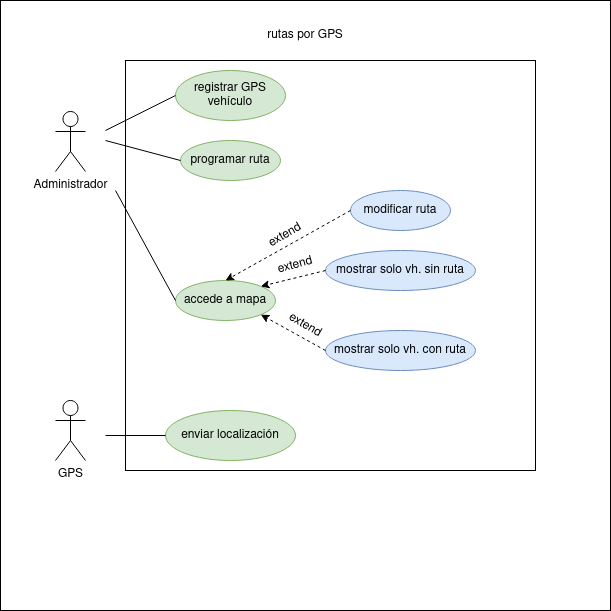

# GPS

## Actores y casos de uso

Administrador: registra GPS de vehículo, programa  ruta, modifica ruta, accede a mapa, mostrar solo vehículos con ruta, mostrar solo vehículos sin ruta

GPS: envia localización

