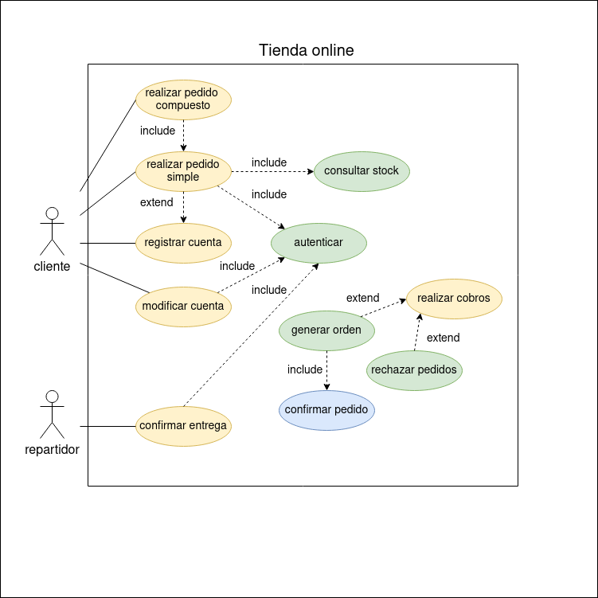

# TAREA 4: Tienda Virtual

## Actores:

    - El cliente
    - Sistema cobro ---> después de verlo en clase me cuadra más verlo como un c.u. del propio sistema
    - Repartidor

## Casos de uso:

    - CU1: registrar cuenta
    - CU2: modificar cuenta
    - CU3: realizar pedido simple
    - CU4: realizar pedido compuesto
    - CU5: consultar stock
    - CU6: relizar cobros
    - CU7: rechazar pedido
    - CU8: generar orden
    - CU9: confirmar pedido
    - CU10: confirmar entrega
    - CU11: autenticar

## Diagrama de CU

## Especificación de actores

  | Actor | Cliente |
  |---|---|
  | Descripción  | El cliente es un usuario que utiliza la plataforma para realizar sus compras online. |
  | Características  | El cliente puede tener varias cuentas, cada una de ellas con una tarjeta asociada para realizar los pagos. Cada cuenta tiene asignado un límite de saldo. Debe autenticarse. |
  | Relaciones | |
  | Referencias | |   
  | Notas | |
  | Autor | _Javier García Hernández_ |
  | Fecha | _23/01/2023_ |

  | Actor | Repartidor |
  |---|---|
  | Descripción  | Usuario que emplea la plataforma para confirmar la entrega de los pedidos que le van siendo asignados. |
  | Características  | Debe autenticarse. |
  | Relaciones | |
  | Referencias | |   
  |  Notas | |
  | Autor  | _Javier García Hernández_ |
  |Fecha | _23/01/2023_ |

  | Actor | Sistema cobro ( como comenté arriba me gusta más verlo como el propio sistema ) |
  |---|---|
  | Descripción  | Sistema que realiza la toma de decisiones a la hora de realizar los cobros de los pedidos registrados por los clientes. |
  | Características  | Puede acceder a la información de la tienda y las cuentas de los usuarios necesaria para evaluar que pedidos se pueden realiar y cuales deben ser rechazados. |
  | Relaciones | |
  | Referencias | |   
  |  Notas | Realiza la evaluación de los pedidos diariamente, alas 23:59. |
  | Autor  | _Javier García Hernández_ |
  |Fecha | _23/01/2023_ |
  
## Especificación de casos de uso

|  Caso de Uso	CU.1 | Registrar cuenta |
|---|---|
| Fuentes  | El caso de uso se sustenta en [este documento](https://github.com/jpexposito/ets/tree/main/diagramas-comportamiento/diagramas-cu/tareas/tarea6).  |
| Actor  | Cliente |
| Descripción | Creación de cuentas por el cliente. Un mismo cliente puede crear tantas cuentas como desee. |
| Flujo básico | El cliente solicita registrar una cuenta. Se le solicitan los datos. Se comprueba que son correctos. Se confirma la crearción de la cuenta. |
| Pre-condiciones |  |  
| Post-condiciones  |  |  
|  Requerimientos | Una tarjeta para realizar los pagos con saldo suficiente disponible |
|  Notas | El cliente debe indicar que cantidad de saldo dispone para los pagos |
| Autor  | _Javier García Hernández_ |
|Fecha | _23/01/23_ |

|  Caso de Uso	CU.2 | Modificar cuenta |
|---|---|
| Fuentes  | El caso de uso se sustenta en [este documento](https://github.com/jpexposito/ets/tree/main/diagramas-comportamiento/diagramas-cu/tareas/tarea6).  |
| Actor  | Cliente |
| Descripción | Modificación de cuentas por el cliente. El cliente puede modificar la cantidad de dinero disponible en la cuenta. |
| Flujo básico | El cliente solicita modificar una cuenta. Si no está autenticado ya, se le solicita. Una vez realiza los cambios se le pide que los confirme. |
| Pre-condiciones | Estar autenticado |  
| Post-condiciones  |  |  
|  Requerimientos | Existencia de la cuenta y saldo suficiente disponible en la tarjeta |
|  Notas | Este saldo queda a disposición de la aplicación, no es un límite, es el dinero que el usuario ha "ingresado" en la cuenta. |
| Autor  | _Javier García Hernández_ |
|Fecha | _23/01/23_ |

|  Caso de Uso	CU.3 | Realizar pedido simple |
|---|---|
| Fuentes  | El caso de uso se sustenta en [este documento](https://github.com/jpexposito/ets/tree/main/diagramas-comportamiento/diagramas-cu/tareas/tarea6).  |
| Actor  | Cliente |
| Descripción | El cliente podrá realizar sus pedidos, asociándolos a una de sus cuentas. |
| Flujo básico | El cliente solicita realizar un pedido. Si no está autenticado* ya, se le solicita y, si así lo desea, puede registrar una nueva cuenta para realizar el pedido. Una vez autenticado se comprueba que la cuenta tiene asociada una tarjeta con saldo*. Cuando selecciona un producto se comprueba que hay stock antes de incluirlo en el pedido.  |
| Pre-condiciones | Autenticado y saldo? * |  
| Post-condiciones  |  |  
|  Requerimientos | Existencia de una cuenta con saldo suficiente disponible. |
|  Notas | |
| Autor  | _Javier García Hernández_ |
|Fecha | _23/01/23_ |

|  Caso de Uso	CU.4 | Realizar pedido compuesto |
|---|---|
| Fuentes  | El caso de uso se sustenta en [este documento](https://github.com/jpexposito/ets/tree/main/diagramas-comportamiento/diagramas-cu/tareas/tarea6).  |
| Actor  | Cliente |
| Descripción | El cliente puede crear un pedido compuesto, que se compondrá de diferentes pedidos individuales o compuestos pero se realizará el pago desde una misma cuenta. |
| Flujo básico | El cliente solicita realizar un pedido compuesto. Puede ir incluyendo pedidos individuales en cada uno de los pedidos compuestos comprendidos dentro del pedido compuesto general. Del mismo modo puede añadir nuevos pedidos compuestos cuando desee. |
| Pre-condiciones | Autenticado y saldo* |  
| Post-condiciones  |  |  
| Requerimientos | Existencia de una cuenta y saldo suficiente disponible. |
| Notas | Como cada pedido individual incluye las comprobaciones necesarias, se obvia que es en ese paso donde el usuario debe autenticarse y el sistema evalua la existencia de stock y saldo. |
| Autor  | _Javier García Hernández_ |
| Fecha | _23/01/23_ |

|  Caso de Uso	CU.5 | Consultar stock |
|---|---|
| Fuentes  | El caso de uso se sustenta en [este documento](https://github.com/jpexposito/ets/tree/main/diagramas-comportamiento/diagramas-cu/tareas/tarea6).  |
| Actor  | Sistema |
| Descripción | Se comprueba que las existencias del producto son suficientes para cubrir el pedido. |
| Flujo básico | Se consulta la cantidad de producto existente y se compara con la cantidad pedida |
| Pre-condiciones | Se esta realizando un pedido y se añade un nuevo producto |  
| Post-condiciones  |  |  
| Requerimientos |  |
| Notas | Si no existe el producto se tendría que comunicar que es así y resolver como si no hubiese stock |
| Autor  | _Javier García Hernández_ |
| Fecha | _23/01/23_ |

|  Caso de Uso	CU.6 | Realizar cobro |
|---|---|
| Fuentes  | El caso de uso se sustenta en [este documento](https://github.com/jpexposito/ets/tree/main/diagramas-comportamiento/diagramas-cu/tareas/tarea6).  |
| Actor  | Sistema |
| Descripción | Se comprueban los pedidos pendientes de confirmación y se decide para cada uno de ellos si se cobra y confirma o se rechaza. |
| Flujo básico | Para cada pedido individual se comprueba que existe saldo disponible para realizar el pago. Si no hay saldo se rechaza el pedido individual. Si hay saldo se cobra y se genera la orden correspondiente. |
| Pre-condiciones | Automático a las 23:59 de cada día |  
| Post-condiciones  |  |  
| Requerimientos | Exista al menos un pedido* |
| Notas | La generación de ordenes es un caso de uso en sí que va a sociado a haber cobrado un pedido individual. Se trata de un saldo gestionado por la propia aplicación. |
| Autor  | _Javier García Hernández_ |
| Fecha | _23/01/23_ |

|  Caso de Uso	CU.7 | Rechazar pedido |
|---|---|
| Fuentes  | El caso de uso se sustenta en [este documento](https://github.com/jpexposito/ets/tree/main/diagramas-comportamiento/diagramas-cu/tareas/tarea6).  |
| Actor  | Sistema |
| Descripción | Se cambia el estado del pedido a rechazado ( se pdoría generar un informe de los motivos y dar un tiempo al cliente para solucionar los problemas y poder solicitar que se procese de nuevo el mismo pedido ) |
| Flujo básico | Para un pedido individual se cambia el estado a rechazado. |
| Pre-condiciones | Habiendo sido procesado para el cobro se detecta que no hay saldo suficiente en la cuenta correspondiente. |  
| Post-condiciones  | |  
| Requerimientos | |
| Notas | Aunque no se habla de 'estado' de pedido como tal, entiendo que para poder reflejar las distintas etapas por las que pasa el pedido se utilizará una variable. |
| Autor  | _Javier García Hernández_ |
| Fecha | _23/01/23_ |

|  Caso de Uso	CU.8 | Generar orden |
|---|---|
| Fuentes  | El caso de uso se sustenta en [este documento](https://github.com/jpexposito/ets/tree/main/diagramas-comportamiento/diagramas-cu/tareas/tarea6).  |
| Actor  | Sistema |
| Descripción | Se genera la información asociada para poder proceder al envío del pedido correspondiente que ya ha sido cobrado. |
| Flujo básico | Se vuelcan los datos del pedido en un documento para poder proceder al envío correspondiente. |
| Pre-condiciones | Un pedido individual ha sido cobrado. |  
| Post-condiciones  | La orden generada debe ser confirmada. |  
| Requerimientos | |
| Notas | Lo que suponga confirmar la orden o no no está especificado. El hecho de que la confirmación sea necesaria para poder dar por buena la generación no tiene por qué ser así, podría generarse y quedarse a la espera de confirmación. |
| Autor  | _Javier García Hernández_ |
| Fecha | _23/01/23_ |

|  Caso de Uso	CU.9 | Confirmar pedido |
|---|---|
| Fuentes  | El caso de uso se sustenta en [este documento](https://github.com/jpexposito/ets/tree/main/diagramas-comportamiento/diagramas-cu/tareas/tarea6).  |
| Actor  | Sistema |
| Descripción | Se confirma la orden para ser enviada |
| Flujo básico | Se evalúa la orden y si todo está correcto se confirma el pedido |
| Pre-condiciones | Se ha generado una orden |  
| Post-condiciones  | |  
| Requerimientos | |
| Notas | Lo que suponga confirmar la orden o no no está especificado. El hecho de que la confirmación sea necesaria para poder dar por buena la generación no tiene por qué ser así, podría generarse y quedarse a la espera de confirmación. |
| Autor  | _Javier García Hernández_ |
| Fecha | _23/01/23_ |

|  Caso de Uso	CU.10 | Confirmar entrega |
|---|---|
| Fuentes  | El caso de uso se sustenta en [este documento](https://github.com/jpexposito/ets/tree/main/diagramas-comportamiento/diagramas-cu/tareas/tarea6).  |
| Actor  | Repartidor |
| Descripción | El repartidor confirma que el pedido ha sido entregado. |
| Flujo básico | El repartidor se identifica y marca el pedido entregado como entregado. |
| Pre-condiciones | Se ha generado una orden y esta ha sido confirmada para envío. |  
| Post-condiciones  | |  
| Requerimientos | |
| Notas | |
| Autor  | _Javier García Hernández_ |
| Fecha | _23/01/23_ |

|  Caso de Uso	CU.11 | Autenticar |
|---|---|
| Fuentes  | El caso de uso se sustenta en [este documento](https://github.com/jpexposito/ets/tree/main/diagramas-comportamiento/diagramas-cu/tareas/tarea6).  |
| Actor  | Sistema |
| Descripción | Comprueba las credenciales del usuario |
| Flujo básico | Se solicitan al usuario sus credenciales. Se comprueba que son correctas. Se le autentica si todo es correcto. Si no es así se le comunica el error y se le dan un cierto número de intentos adicionales. Agotados dichos intentos se inhabilita la posibilidad de autenticación. |
| Pre-condiciones | El usuario solicita autenticarse o el sistema lo requiere para un cu del usuario |  
| Post-condiciones  | |  
| Requerimientos | Los que deba cumplir la orden y los implicados en su reparto |
| Notas | |
| Autor  | _Javier García Hernández_ |
| Fecha | _23/01/23_ |