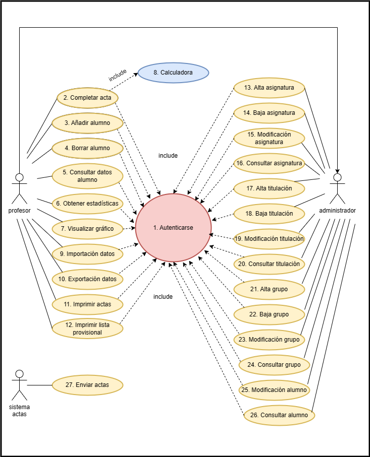

# TAREA Gestión Centro Profesores

## ACTORES:
  
    - Profesor
    - Profesor con privilegios de administrador ( hereda de Profesor )
    - Sistema de actas

## CASOS DE USO

    - CU del Profesor:
        1. Autenticarse
        2. Completar acta
        3. Añadir alumno
        4. Borrar alumno
        5. Consultar datos alumno
        6. Obtener estadísticas 
        7. Visualizar gráfico
        9. Importación datos
        10. Exportación datos
        11. Imprimir actas
        12. Imprimir lista provisional
    - CU consecuencia de anteriores:
        8. Calculadora
    - CU profesor-administrador:
        13. Alta asignatura
        14. Baja asignatura
        15. Modificacion asignatura
        16. Consulta asignatura 
        17. Alta titulación
        18. Baja titulación
        19. Modificacion titulación
        20. Consulta titulación
        21. Alta grupo
        22. Baja grupo
        23. Modificacion grupo
        24. Consulta grupo
        25. Modificacion alumno
        26. Consulta alumno   
    -CU Sistema de actas:
        27. Enviar actas

## DIAGRAMA DE CASOS DE USO

## Especificación de actores

  | Actor | Sistema de actas |
  |---|---|
  | Descripción  | Hace llegar las actas en formato electrónico para poder ser procesadas por el sistema |
  | Características  | Solo nos importa que proporciona la plantilla sobre la que el sistema permite elaborar el acta |
  | Relaciones | |
  | Referencias | |   
  | Notas | |
  | Autor | _Javier García Hernández_ |
  | Fecha | _03/02/2023_ |

  | Actor | Profesor |
  |---|---|
  | Descripción  | Usuario que puede cumplimentar el acta con la información de los alumnos así como solicitar cierta información al sistema |
  | Características  | Debe autenticarse |
  | Relaciones | |
  | Referencias | |   
  |  Notas | |
  | Autor  | _Javier García Hernández_ |
  |Fecha | _3/02/2023_ |

  | Actor | Profesor administrador |
  |---|---|
  | Descripción  | Es un profesor con permisos adicionales que le permiten realizar tareas de CRUD sobre diferentes conjuntos de datos |
  | Características  | Debe autenticarase |
  | Relaciones | Hereda de profesor |
  | Referencias | |   
  |  Notas | Debe tener concedidos permisos de administrador |
  | Autor  | _Javier García Hernández_ |
  |Fecha | _3/02/2023_ |
  
## Especificación de casos de uso

|  Caso de Uso	CU.1 | Autenticarse |
|---|---|
| Fuentes  | El caso de uso se sustenta en [este documento] https://github.com/jpexposito/ets/tree/main/diagramas-comportamiento/diagramas-cu/tareas/tarea7  |
| Actor  | sistema |
| Descripción | Para realizar cualquier CU el profesor debe autenticarse |
| Flujo básico | En el momento de ir a realizar cualquier caso de uso que requiera estar autenticado, si no lo está, el sistema pide al usuario que lo haga |
| Pre-condiciones | Caso de uso que requiere autenticación |  
| Post-condiciones  |  |  
|  Requerimientos | Estar registrado en el sistema |
|  Notas | |
| Autor  | _Javier García Hernández_ |
|Fecha | _3/02/23_ |

|  Caso de Uso	CU.2 | Completar acta |
|---|---|
| Fuentes  | El caso de uso se sustenta en [este documento] https://github.com/jpexposito/ets/tree/main/diagramas-comportamiento/diagramas-cu/tareas/tarea7 |
| Actor  | Profesor |
| Descripción | El profesor puede rellenar con la información de los alumnos el acta que el sistema le facilita |
| Flujo básico | El profesor debe ir incorporando la información de los diferentes alumnos. Si no está autenticado se le solicita (CU1). Cuando introduzca una nota se le abrirá la calculadora (CU8) |
| Pre-condiciones | Estar autenticado |  
| Post-condiciones  |  |  
|  Requerimientos | Debe de existir el acta correspondiente |
|  Notas | El acta se recibe desde otro sistema (CU27) |
| Autor  | _Javier García Hernández_ |
|Fecha | _3/02/23_ |

|  Caso de Uso	CU.3 | Añadir alumno |
|---|---|
| Fuentes  | El caso de uso se sustenta en [este documento] https://github.com/jpexposito/ets/tree/main/diagramas-comportamiento/diagramas-cu/tareas/tarea7 |
| Actor  | Profesor |
| Descripción | El profesor puede añadir alumnos |
| Flujo básico | El profesor solicita añadir un nuevo alumno, si no está autenticado se le solicita (CU1) |
| Pre-condiciones | Estar autenticado |  
| Post-condiciones  | |  
|  Requerimientos | |
|  Notas | |
| Autor  | _Javier García Hernández_ |
|Fecha | _3/02/23_ |

|  Caso de Uso	CU.4 | Realizar pedido compuesto |
|---|---|
| Fuentes  | El caso de uso se sustenta en [este documento] https://github.com/jpexposito/ets/tree/main/diagramas-comportamiento/diagramas-cu/tareas/tarea7  |
| Actor  | Profesor |
| Descripción | El profesor puede borrar alumnos |
| Flujo básico | El profesor solicita borrar un alumno, si no está autenticado se le solicita (CU1) |  
| Pre-condiciones | Estar autenticado | 
| Post-condiciones  | |  
| Requerimientos | |
| Autor  | _Javier García Hernández_ |
| Fecha | _3/02/23_ |

|  Caso de Uso	CU.5 | Consultar datos alumno |
|---|---|
| Fuentes  | El caso de uso se sustenta en [este documento] https://github.com/jpexposito/ets/tree/main/diagramas-comportamiento/diagramas-cu/tareas/tarea7  |
| Actor  | Profesor |
| Descripción | El profesor puede consultar una serie de datos sobre los alumnos que le corresponden |
| Flujo básico | El profesor solicita consultar información de un alumno, si no está autenticado se le solicita (CU1) |
| Pre-condiciones | Estar autenticado |  
| Post-condiciones  | |  
| Requerimientos | |
| Notas | |
| Autor  | _Javier García Hernández_ |
| Fecha | _3/02/23_ |

|  Caso de Uso	CU.6 | Obtener estadísticas |
|---|---|
| Fuentes  | El caso de uso se sustenta en [este documento] https://github.com/jpexposito/ets/tree/main/diagramas-comportamiento/diagramas-cu/tareas/tarea7  |
| Actor  | Profesor |
| Descripción | El profesor puede solicitar diferentes informes estadísticos |
| Flujo básico | El profesor solicita el informe, si no está autenticado se le solicita (CU1) | 
| Pre-condiciones | Estar autenticado | 
| Post-condiciones  |  |  
| Requerimientos | |
| Notas | |
| Autor  | _Javier García Hernández_ |
| Fecha | _3/02/23_ |

|  Caso de Uso	CU.7 | Visualizar gráfico |
|---|---|
| Fuentes  | El caso de uso se sustenta en [este documento] https://github.com/jpexposito/ets/tree/main/diagramas-comportamiento/diagramas-cu/tareas/tarea7  |
| Actor  | Profesor |
| Descripción |El profesor puede solicitar visualizar informácion representada gráficamente |
| Flujo básico | El profesor solicita ver el gráfico, si no está autenticado se le solicita (CU1) |
| Pre-condiciones | Estar autenticado |  
| Post-condiciones  | |  
| Requerimientos | |
| Notas | |
| Autor  | _Javier García Hernández_ |
| Fecha | _3/02/23_ |

|  Caso de Uso	CU.8 | Calculadora |
|---|---|
| Fuentes  | El caso de uso se sustenta en [este documento] https://github.com/jpexposito/ets/tree/main/diagramas-comportamiento/diagramas-cu/tareas/tarea7  |
| Actor  | Sistema |
| Descripción | La calculadora permite realizar diferentes operaciones matemáticas |
| Flujo básico | Cuando el profesor va a introducir una nota se lanza automáticamente la calculadora |
| Pre-condiciones | Estar completando el acta (CU2) |  
| Post-condiciones  | |  
| Requerimientos | |
| Notas | |
| Autor  | _Javier García Hernández_ |
| Fecha | _3/02/23_ |

|  Caso de Uso	CU.9 | Inportación de datos |
|---|---|
| Fuentes  | El caso de uso se sustenta en [este documento] https://github.com/jpexposito/ets/tree/main/diagramas-comportamiento/diagramas-cu/tareas/tarea7 |
| Actor  | Profesor |
| Descripción | Se pide la exportación de los datos en formato MS Excel |
| Flujo básico | El profesor solicita la exportación de los datos, si no está autenticado se le solicita (CU1) |
| Pre-condiciones | Estar autenticado |  
| Post-condiciones  | |  
| Requerimientos | |
| Notas | |
| Autor  | _Javier García Hernández_ |
| Fecha | _3/02/23_ |

|  Caso de Uso	CU.10 | Exportación datos |
|---|---|
| Fuentes  | El caso de uso se sustenta en [este documento] https://github.com/jpexposito/ets/tree/main/diagramas-comportamiento/diagramas-cu/tareas/tarea7 |
| Actor  | Profesor |
| Descripción | Se pide la importación de los datos en formato MS Excel |
| Flujo básico | El profesor solicita la importación de los datos, si no está autenticado se le solicita (CU1) |
| Pre-condiciones | Estar autenticado |  
| Post-condiciones  | |  
| Requerimientos | |
| Notas | |
| Autor  | _Javier García Hernández_ |
| Fecha | _3/02/23_ |

|  Caso de Uso	CU.11 | Imprimir acta |
|---|---|
| Fuentes  | El caso de uso se sustenta en [este documento] https://github.com/jpexposito/ets/tree/main/diagramas-comportamiento/diagramas-cu/tareas/tarea7 |
| Actor  | Profesor |
| Descripción | Imprimir acta |
| Flujo básico | El profesor solicita imprimir el documento, si no está autenticado se le solicita (CU1) |
| Pre-condiciones | Estar autenticado |  
| Post-condiciones  | |  
| Requerimientos | |
| Notas | |
| Autor  | _Javier García Hernández_ |
| Fecha | _3/02/23_ |

|  Caso de Uso	CU.12 | Imprimir lista provisional |
|---|---|
| Fuentes  | El caso de uso se sustenta en [este documento] https://github.com/jpexposito/ets/tree/main/diagramas-comportamiento/diagramas-cu/tareas/tarea7 |
| Actor  | Profesor |
| Descripción | Imprimir lista provisional |
| Flujo básico | El profesor solicita imprimir el documento, si no está autenticado se le solicita (CU1) |
| Pre-condiciones | Estar autenticado |  
| Post-condiciones  | |  
| Requerimientos | |
| Notas | |
| Autor  | _Javier García Hernández_ |
| Fecha | _3/02/23_ |

|  Caso de Uso	CU.13 | Alta asignatura |
|---|---|
| Fuentes  | El caso de uso se sustenta en [este documento] https://github.com/jpexposito/ets/tree/main/diagramas-comportamiento/diagramas-cu/tareas/tarea7 |
| Actor  | Administrador |
| Descripción | El administrador puede dar de alta asignaturas |
| Flujo básico | El administrador solicita dar de alta una nueva asignatura, si no está autenticado se le solicita (CU1) |
| Pre-condiciones | Estar autenticado |  
| Post-condiciones  | |  
|  Requerimientos | |
|  Notas | |
| Autor  | _Javier García Hernández_ |
|Fecha | _3/02/23_ |

|  Caso de Uso	CU.14 | Baja asignatura |
|---|---|
| Fuentes  | El caso de uso se sustenta en [este documento] https://github.com/jpexposito/ets/tree/main/diagramas-comportamiento/diagramas-cu/tareas/tarea7 |
| Actor  | Administrador |
| Descripción | El administrador puede dar de baja asignaturas |
| Flujo básico | El administrador solicita dar de baja una asignatura, si no está autenticado se le solicita (CU1) |
| Pre-condiciones | Estar autenticado |  
| Post-condiciones  | |  
|  Requerimientos | |
|  Notas | |
| Autor  | _Javier García Hernández_ |
|Fecha | _3/02/23_ |

|  Caso de Uso	CU.15 | Modificar asignatura |
|---|---|
| Fuentes  | El caso de uso se sustenta en [este documento] https://github.com/jpexposito/ets/tree/main/diagramas-comportamiento/diagramas-cu/tareas/tarea7 |
| Actor  | Administrador |
| Descripción | El administrador puede modificar asignaturas |
| Flujo básico | El administrador solicita modificar una asignatura, si no está autenticado se le solicita (CU1) |
| Pre-condiciones | Estar autenticado |  
| Post-condiciones  | |  
|  Requerimientos | |
|  Notas | |
| Autor  | _Javier García Hernández_ |
|Fecha | _3/02/23_ |

|  Caso de Uso	CU.16 | Consultar asignatura |
|---|---|
| Fuentes  | El caso de uso se sustenta en [este documento] https://github.com/jpexposito/ets/tree/main/diagramas-comportamiento/diagramas-cu/tareas/tarea7 |
| Actor  | Administrador |
| Descripción | El administrador puede consultar asignaturas |
| Flujo básico | El administrador solicita consultar una asignatura, si no está autenticado se le solicita (CU1) |
| Pre-condiciones | Estar autenticado |  
| Post-condiciones  | |  
|  Requerimientos | |
|  Notas | |
| Autor  | _Javier García Hernández_ |
|Fecha | _3/02/23_ |

|  Caso de Uso	CU.17 | Alta titulación |
|---|---|
| Fuentes  | El caso de uso se sustenta en [este documento] https://github.com/jpexposito/ets/tree/main/diagramas-comportamiento/diagramas-cu/tareas/tarea7 |
| Actor  | Administrador |
| Descripción | El administrador puede dar de alta titulaciones |
| Flujo básico | El administrador solicita dar de alta una nueva titulación, si no está autenticado se le solicita (CU1) |
| Pre-condiciones | Estar autenticado |  
| Post-condiciones  | |  
|  Requerimientos | |
|  Notas | |
| Autor  | _Javier García Hernández_ |
|Fecha | _3/02/23_ |

|  Caso de Uso	CU.18 | Baja titulación |
|---|---|
| Fuentes  | El caso de uso se sustenta en [este documento] https://github.com/jpexposito/ets/tree/main/diagramas-comportamiento/diagramas-cu/tareas/tarea7 |
| Actor  | Administrador |
| Descripción | El administrador puede dar de baja titulaciones |
| Flujo básico | El administrador solicita dar de baja una titulación, si no está autenticado se le solicita (CU1) |
| Pre-condiciones | Estar autenticado |  
| Post-condiciones  | |  
|  Requerimientos | |
|  Notas | |
| Autor  | _Javier García Hernández_ |
|Fecha | _3/02/23_ |

|  Caso de Uso	CU.19 | Modificar titulación |
|---|---|
| Fuentes  | El caso de uso se sustenta en [este documento] https://github.com/jpexposito/ets/tree/main/diagramas-comportamiento/diagramas-cu/tareas/tarea7 |
| Actor  | Administrador |
| Descripción | El administrador puede modificar titulaciones |
| Flujo básico | El administrador solicita modificar una titulaciones, si no está autenticado se le solicita (CU1) |
| Pre-condiciones | Estar autenticado |  
| Post-condiciones  | |  
|  Requerimientos | |
|  Notas | |
| Autor  | _Javier García Hernández_ |
|Fecha | _3/02/23_ |

|  Caso de Uso	CU.20 | Consultar titulación |
|---|---|
| Fuentes  | El caso de uso se sustenta en [este documento] https://github.com/jpexposito/ets/tree/main/diagramas-comportamiento/diagramas-cu/tareas/tarea7 |
| Actor  | Administrador |
| Descripción | El administrador puede consultar titulaciones |
| Flujo básico | El administrador solicita consultar una titulación, si no está autenticado se le solicita (CU1) |
| Pre-condiciones | Estar autenticado |  
| Post-condiciones  | |  
|  Requerimientos | |
|  Notas | |
| Autor  | _Javier García Hernández_ |
|Fecha | _3/02/23_ |

|  Caso de Uso	CU.21 | Alta grupo |
|---|---|
| Fuentes  | El caso de uso se sustenta en [este documento] https://github.com/jpexposito/ets/tree/main/diagramas-comportamiento/diagramas-cu/tareas/tarea7 |
| Actor  | Administrador |
| Descripción | El administrador puede dar de alta grupos |
| Flujo básico | El administrador solicita dar de alta una nuevo grupo, si no está autenticado se le solicita (CU1) |
| Pre-condiciones | Estar autenticado |  
| Post-condiciones  | |  
|  Requerimientos | |
|  Notas | |
| Autor  | _Javier García Hernández_ |
|Fecha | _3/02/23_ |

|  Caso de Uso	CU.22 | Baja grupo |
|---|---|
| Fuentes  | El caso de uso se sustenta en [este documento] https://github.com/jpexposito/ets/tree/main/diagramas-comportamiento/diagramas-cu/tareas/tarea7 |
| Actor  | Administrador |
| Descripción | El administrador puede dar de baja grupos |
| Flujo básico | El administrador solicita dar de baja un grupo, si no está autenticado se le solicita (CU1) |
| Pre-condiciones | Estar autenticado |  
| Post-condiciones  | |  
|  Requerimientos | |
|  Notas | |
| Autor  | _Javier García Hernández_ |
|Fecha | _3/02/23_ |

|  Caso de Uso	CU.23 | Modificar grupo |
|---|---|
| Fuentes  | El caso de uso se sustenta en [este documento] https://github.com/jpexposito/ets/tree/main/diagramas-comportamiento/diagramas-cu/tareas/tarea7 |
| Actor  | Administrador |
| Descripción | El administrador puede modificar grupos |
| Flujo básico | El administrador solicita modificar un grupo, si no está autenticado se le solicita (CU1) |
| Pre-condiciones | Estar autenticado |  
| Post-condiciones  | |  
|  Requerimientos | |
|  Notas | |
| Autor  | _Javier García Hernández_ |
|Fecha | _3/02/23_ |

|  Caso de Uso	CU.24 | Consultar grupo |
|---|---|
| Fuentes  | El caso de uso se sustenta en [este documento] https://github.com/jpexposito/ets/tree/main/diagramas-comportamiento/diagramas-cu/tareas/tarea7 |
| Actor  | Administrador |
| Descripción | El administrador puede consultar grupos |
| Flujo básico | El administrador solicita consultar un grupo, si no está autenticado se le solicita (CU1) |
| Pre-condiciones | Estar autenticado |  
| Post-condiciones  | |  
|  Requerimientos | |
|  Notas | |
| Autor  | _Javier García Hernández_ |
|Fecha | _3/02/23_ |

|  Caso de Uso	CU.25 | Modificar alumno |
|---|---|
| Fuentes  | El caso de uso se sustenta en [este documento] https://github.com/jpexposito/ets/tree/main/diagramas-comportamiento/diagramas-cu/tareas/tarea7 |
| Actor  | Administrador |
| Descripción | El administrador puede modificar alumnos |
| Flujo básico | El administrador solicita modificar un alumno, si no está autenticado se le solicita (CU1) |
| Pre-condiciones | Estar autenticado |  
| Post-condiciones  | |  
|  Requerimientos | |
|  Notas | Alta y baja de alumnos son CU3 y CU4 respectivamente, los hereda de profesor |
| Autor  | _Javier García Hernández_ |
|Fecha | _3/02/23_ |

|  Caso de Uso	CU.26 | Consultar alumno |
|---|---|
| Fuentes  | El caso de uso se sustenta en [este documento] https://github.com/jpexposito/ets/tree/main/diagramas-comportamiento/diagramas-cu/tareas/tarea7 |
| Actor  | Administrador |
| Descripción | El administrador puede consultar alumnos |
| Flujo básico | El administrador solicita consultar un alumno, si no está autenticado se le solicita (CU1) |
| Pre-condiciones | Estar autenticado |  
| Post-condiciones  | |  
|  Requerimientos | |
|  Notas | Alta y baja de alumnos son CU3 y CU4 respectivamente, los hereda de profesor |
| Autor  | _Javier García Hernández_ |
|Fecha | _3/02/23_ |

|  Caso de Uso	CU.27 | Enviar actas |
|---|---|
| Fuentes  | El caso de uso se sustenta en [este documento] https://github.com/jpexposito/ets/tree/main/diagramas-comportamiento/diagramas-cu/tareas/tarea7 |
| Actor  | Sistema actas |
| Descripción | El sistema de actas hace llegar en formato electrónico el acta vacía para cumplimentarla mediante el sistema |
| Flujo básico | LLega el acta al sistema, quedando disponible para ser cumplimentada |
| Pre-condiciones | |  
| Post-condiciones  | |  
|  Requerimientos | |
|  Notas | |
| Autor  | _Javier García Hernández_ |
|Fecha | _3/02/23_ |