# XQuery

_Actividad XML - XQuery 1._

### Ejercicio 1

Dado el siguiente documento XML realiza las siguientes consultas con XQuery:

```
<?xml version="1.0" encoding="UTF-8"?>
<bookstore>
  <book category="COOKING">
    <title lang="en">Everyday Italian</title>
    <author>Giada De Laurentiis</author>
    <year>2005</year>
    <price>30.00</price>
  </book>
  <book category="CHILDREN">
    <title lang="en">Harry Potter</title>
    <author>J K. Rowling</author>
    <year>2005</year>
    <price>29.99</price>
  </book>
  <book category="WEB">
    <title lang="en">XQuery Kick Start</title>
    <author>James McGovern</author>
    <author>Per Bothner</author>
    <author>Kurt Cagle</author>
    <author>James Linn</author>
    <author>Vaidyanathan Nagarajan</author>
    <year>2003</year>
    <price>49.99</price>
  </book>
  <book category="WEB">
    <title lang="en">Learning XML</title>
    <author>Erik T. Ray</author>
    <year>2003</year>
    <price>39.95</price>
  </book>
</bookstore> 
```
### 1.	Mostrar los títulos de los libros con la etiqueta "titulo".

    for $title in /bookstore/book/title/text()
    return $title

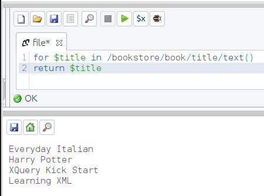

### 2.	Mostrar los libros cuyo precio sea menor o igual a 30. Primero incluyendo la condición en la cláusula "where" y luego en la ruta del XPath.

    for $book in /bookstore/book
    where $book/price <= 30
    return $book

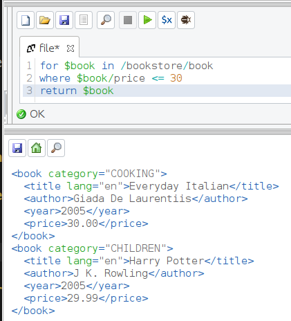

    for $book in /bookstore/book[price<=30]
    return $book

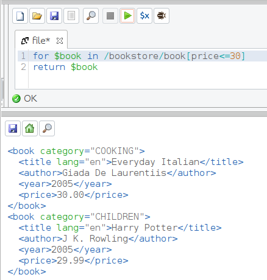

### 3.	Mostrar sólo el título de los libros cuyo precio sea menor o igual a 30.

    for $book in /bookstore/book[price<=30]/title
    return $book

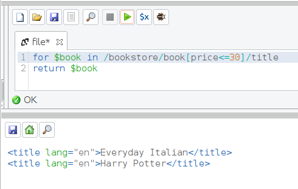

### 4.	Mostrar sólo el título sin atributos de los libros cuyo precio sea menor o igual a 30.

    for $book in /bookstore/book[price<=30]/title/text()
    return $book

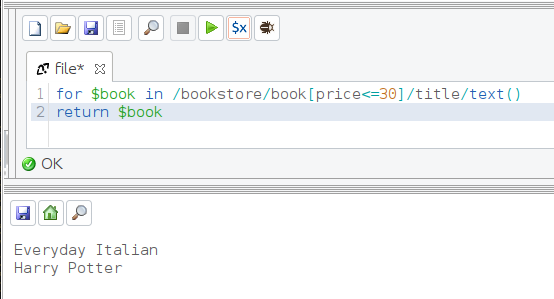

### 5.	Mostrar el título y el autor de los libros del año 2005, y etiquetar cada uno de ellos con "lib2005".

    for $book in /bookstore/book[year=2005]
    return <lib2005>{$book/title}{$book/author}</lib2005>

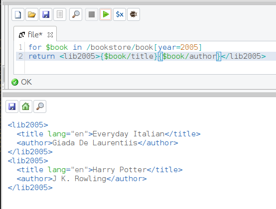

### 6.	Mostrar los años de publicación, primero con "for" y luego con "let" para comprobar la diferencia entre ellos. Etiquetar la salida con "publicacion".

    for $year in /bookstore/book/year
    return <publicacion>{$year}</publicacion>

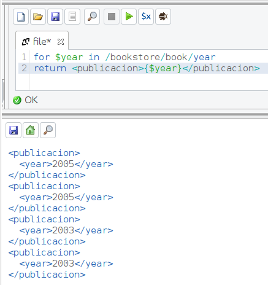

    let $year := /bookstore/book/year
    return <publicacion>{$year}</publicacion>

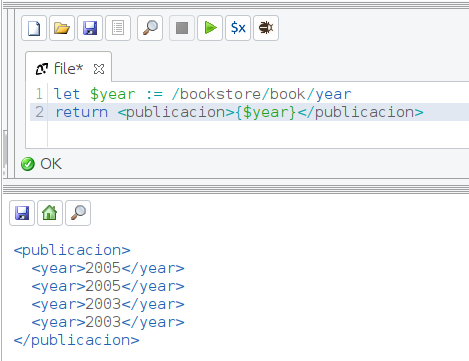

### 7.	Mostrar los libros ordenados primero por "category" y luego por "title" en una sola consulta.

    for $book in /bookstore/book
    order by $book/category, $book/title
    return $book

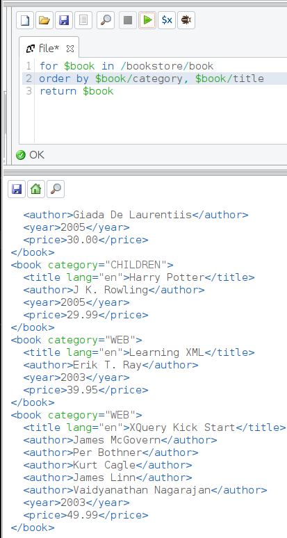

### 8.	Mostrar cuántos libros hay, y etiquetarlo con "total".

    let $total := count (/bookstore/book)
    return <total>{$total}</total>

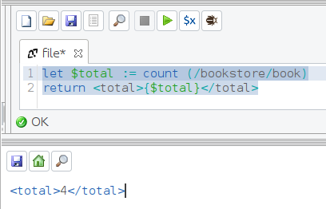

### 9.	Mostrar los títulos de los libros y al final una etiqueta con el número total de libros.

    let $libros := /bookstore/book/title
    let $total := count($libros)
    return <libros>{$libros}<total>{$total}</total></libros>

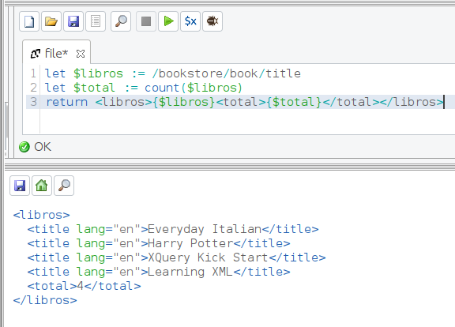

### 10.	Mostrar el precio mínimo y máximo de los libros.

    let $prices := /bookstore/book/price
    return <prices><min>{min($prices)}</min><max>{max($prices)}</max></prices>

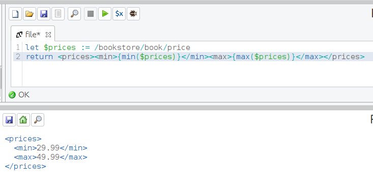

### 11.	Mostrar el título del libro, su precio y su precio con el IVA incluido, cada uno con su propia etiqueta. Ordénalos por precio con IVA.

    for $book in /bookstore/book
    let $titulo := $book/title/text()
    let $precio := $book/price/text()
    let $precio_iva := $precio * 1.04
    order by $precio_iva
    return <libro><titulo>{$titulo}</titulo><precio>{$precio}</precio><precio_iva>{$precio_iva}</precio_iva></libro>

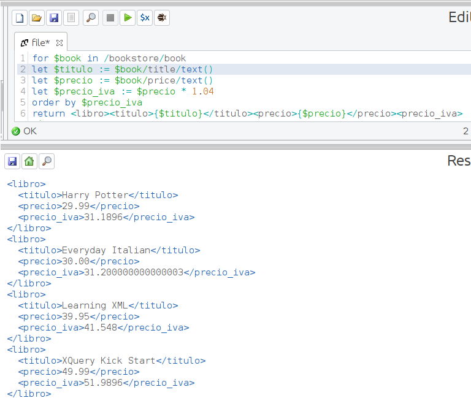

### 12.	Mostrar la suma total de los precios de los libros con la etiqueta "total".

    let $total := sum(/bookstore/book/price)
    return <total>{$total}</total>

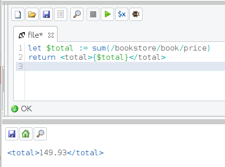

### 13.	Mostrar cada uno de los precios de los libros, y al final una nueva etiqueta con la suma de los precios.

    let $precios := /bookstore/book/price
    let $total := sum($precios)
    return <libros>{$precios}<total>{$total}</total></libros>

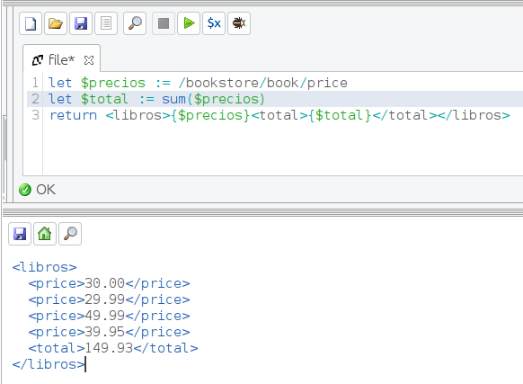

### 14.	Mostrar el título y el número de autores que tiene cada título en etiquetas diferentes.

    for $book in /bookstore/book
    return <libro><titulo>{$book/title/text()}</titulo><num_autores>{count($book/author)}</num_autores></libro>

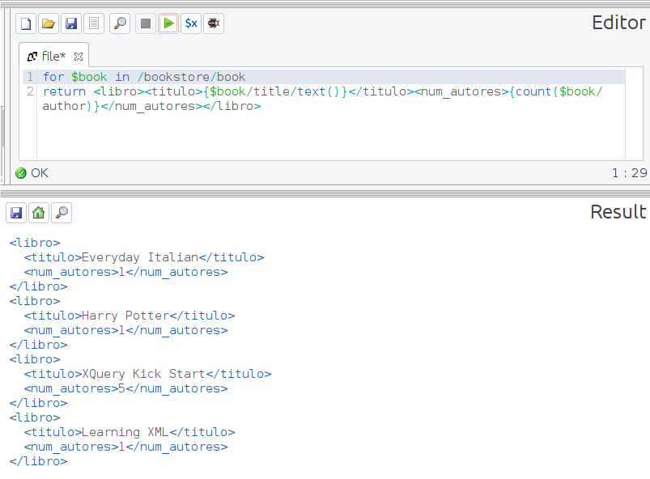

### 15.	Mostrar en la misma etiqueta el título y entre paréntesis el número de autores que tiene ese título.

    for $book in /bookstore/book
    return <libro>{$book/title/text()}({count($book/author)})</libro>

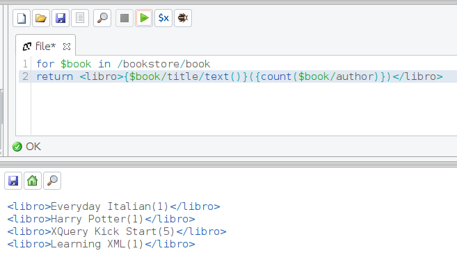

### 16.	Mostrar los libros escritos en años que terminen en "3".

    for $book in /bookstore/book[ends-with(year, '3')]
    return $book

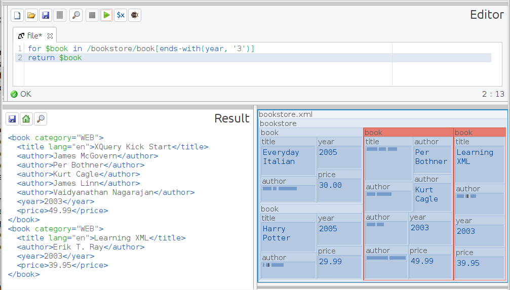

### 17.	Mostrar los libros cuya categoría empiece por "C".

    for $book in /bookstore/book[starts-with(@category, 'C')]
    return $book

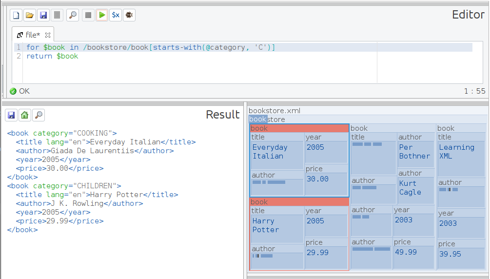

### 18.	Mostrar los libros que tengan una "X" mayúscula o minúscula en el título.

    for $book in /bookstore/book[contains(title, 'X') or contains(title, 'x')]
    return $book

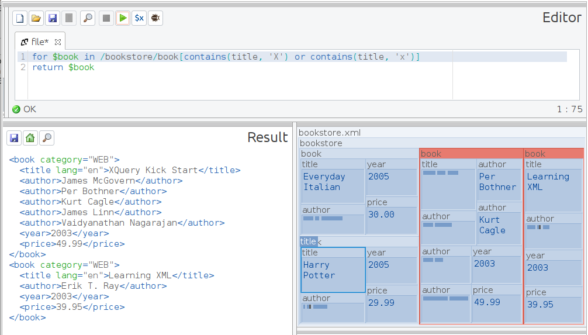

### 19.	Mostrar el título y el número de caracteres que tiene cada título, cada uno con su propia etiqueta.

    for $title in /bookstore/book/title/text()
    return <libro><titulo>{$title}</titulo><caracteres>{string-length($title)}</caracteres></libro>

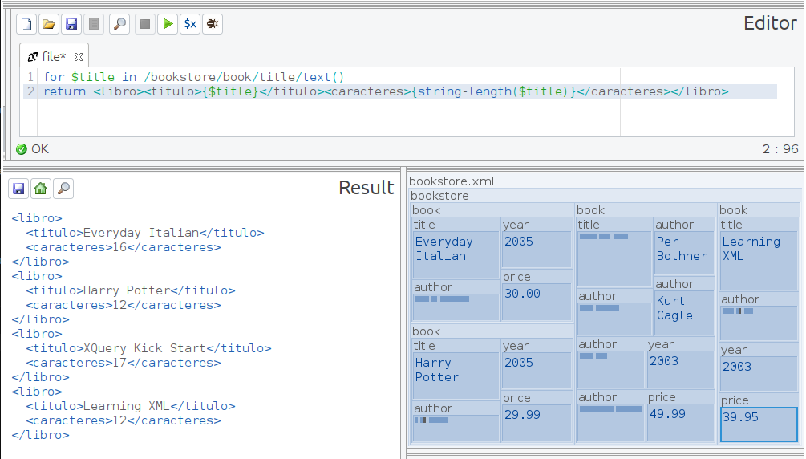

### 20.	Mostrar todos los años en los que se ha publicado un libro eliminando los repetidos. Etiquétalos con "año".

    for $year in distinct-values(/bookstore/book/year)
    return <año>{$year}</año>

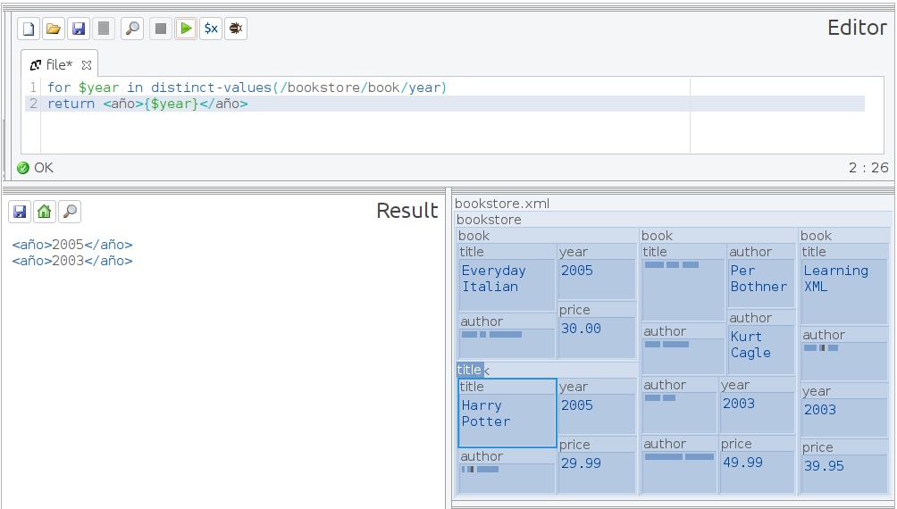

### 21.	Mostrar todos los autores eliminando los que se repiten y ordenados por el número de caracteres que tiene cada autor.

    for $author in distinct-values(/bookstore/book/author)
    order by string-length($author)
    return $author

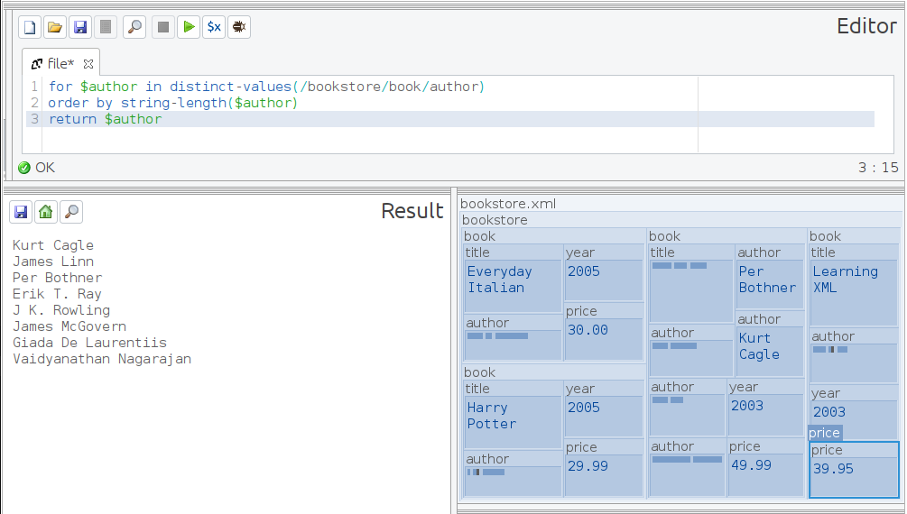

### 22.	Mostrar los títulos en una tabla de HTML.

    let $titles := (for $title in /bookstore/book/title/text()
    return <tr>{$title}</tr>)
    return <table>{$titles}</table>

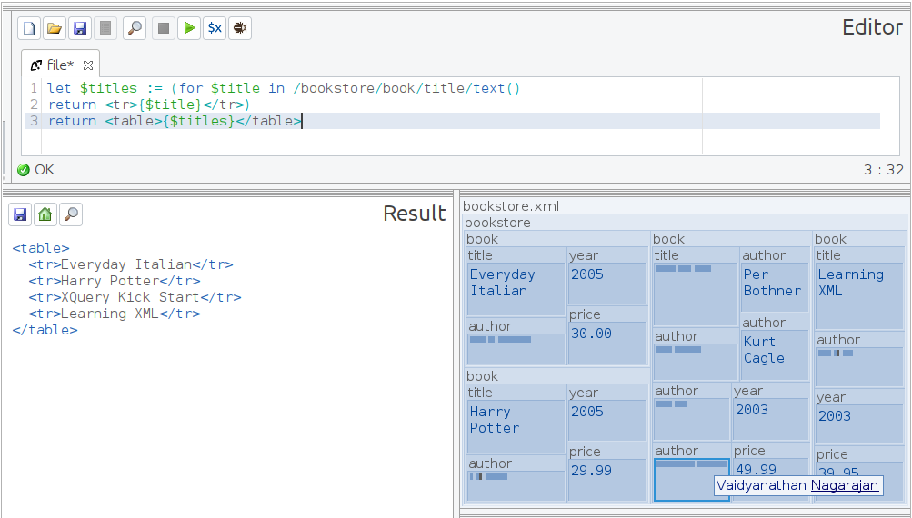
 
