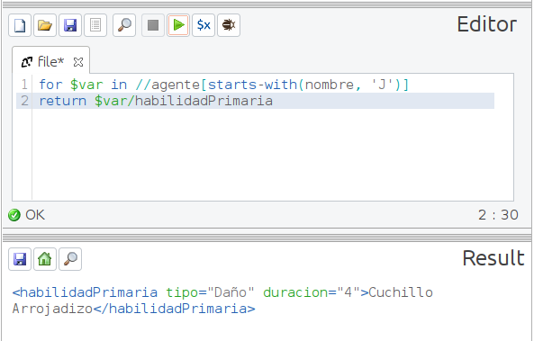
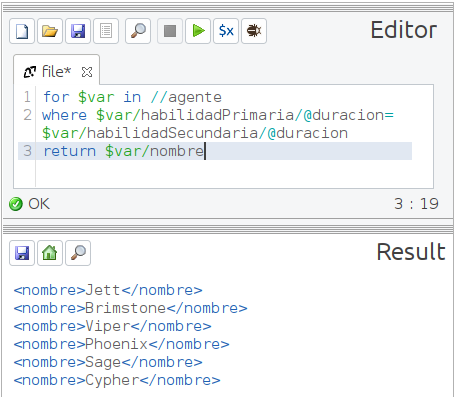

# XQuery

_Actividad XML - XQuery 2._

### Ejercicio 2

Dado el siguiente documento XML realiza las siguientes consultas con XQuery:

```
<?xml version="1.0" encoding="UTF-8"?>
<videojuego>
  <titulo>Valorant</titulo>
  <genero>Juego de disparos en primera persona</genero>
  <plataforma>PC</plataforma>
  <desarrollador>Riot Games</desarrollador>
  <fechaLanzamiento>2 de junio de 2020</fechaLanzamiento>
  <agentes>
    <agente>
      <nombre>Jett</nombre>
      <habilidadPrimaria tipo="Daño" duracion="4">Cuchillo Arrojadizo</habilidadPrimaria>
      <habilidadSecundaria tipo="Curación" duracion="0">Vientos Ligeros</habilidadSecundaria>
      <habilidadUltimate tipo="Daño" duracion="6">Tormenta de Cuchillos</habilidadUltimate>
    </agente>
    <agente>
      <nombre>Brimstone</nombre>
      <habilidadPrimaria tipo="Daño" duracion="6">Granada Incendiaria</habilidadPrimaria>
      <habilidadSecundaria tipo="Curación" duracion="0">Estímulo de Combate</habilidadSecundaria>
      <habilidadUltimate tipo="Daño" duracion="4">Incendiario Orbital</habilidadUltimate>
    </agente>
    <agente>
      <nombre>Viper</nombre>
      <habilidadPrimaria tipo="Daño" duracion="8">Nube Venenosa</habilidadPrimaria>
      <habilidadSecundaria tipo="Daño" duracion="6">Pantalla Tóxica</habilidadSecundaria>
      <habilidadUltimate tipo="Curación" duracion="12">Recolección Táctica</habilidadUltimate>
    </agente>
    <agente>
      <nombre>Phoenix</nombre>
      <habilidadPrimaria tipo="Daño" duracion="4">Bola Curva de Fuego</habilidadPrimaria>
      <habilidadSecundaria tipo="Curación" duracion="0">Escudo Curativo</habilidadSecundaria>
      <habilidadUltimate tipo="Daño" duracion="6">Explosión Cósmica</habilidadUltimate>
    </agente>
    <agente>
      <nombre>Sage</nombre>
      <habilidadPrimaria tipo="Curación" duracion="0">Orbe de Curación</habilidadPrimaria>
      <habilidadSecundaria tipo="Daño" duracion="4">Muro de Hielo</habilidadSecundaria>
      <habilidadUltimate tipo="Curación" duracion="5">Resurrección</habilidadUltimate>
    </agente>
    <agente>
      <nombre>Cypher</nombre>
      <habilidadPrimaria tipo="Daño" duracion="4">Trampa Cibernética</habilidadPrimaria>
      <habilidadSecundaria tipo="Daño" duracion="7">Cámara Espía</habilidadSecundaria>
      <habilidadUltimate tipo="Curación" duracion="0">Ataque de Neurona</habilidadUltimate>
    </agente>
  </agentes>
</videojuego>
```
### 1. Muestra el título del videojuego.


### 2. Muestra la plataforma del videojuego.


### 3. Muestra el nombre de todos los agentes.


### 4. Muestra el nombre y la habilidad ultimate de todos los agentes.


### 5. Muestra los nombres de los agentes cuya habilidad primaria es "Incendiario".


### 6. Muestra los nombres de los agentes cuya habilidad ultimate es "Fénix".


### 7.	Muestra las habilidades primarias de los agentes cuyo nombre empieza por "J".



### 8.	Muestra los nombres de los agentes cuyas habilidades primarias empiezan por "Bola".


### 9. Muestra los nombres de todos los agentes en orden alfabético.


### 10. Muestra las habilidades primarias y secundarias de los agentes cuyo nombre contiene la letra "y".


### 11. Muestra los nombres de los agentes cuya habilidad ultimate contiene la palabra "cuchillos".


### 12. Muestra las habilidades primarias de los agentes cuyo nombre contiene la letra "o" y la habilidad secundaria contiene la palabra "humo".


### 13. Muestra los nombres de los agentes que tienen exactamente tres habilidades.


### 14. Muestra los nombres de los agentes cuya habilidad secundaria no es "Granada Cegadora".


### 15. Muestra las habilidades primarias de los agentes cuyos nombres no contienen la letra "e".


### 16. Muestra los nombres de los agentes cuyas habilidades primarias contienen la palabra "muro" o la palabra "barrera".


### 17. Muestra las habilidades ultimates de los agentes en orden alfabético inverso.


### 18. Muestra los nombres de los agentes cuya habilidad ultimate tiene una duración mayor a 8 segundos.


### 19. Muestra el nombre del agente con la habilidad ultimate más corta.


### 20. Muestra los nombres de los agentes que tienen habilidades primarias y secundarias con la misma duración.



### 21. Muestra el nombre de los agentes que tienen habilidades primarias y secundarias que pertenecen al mismo tipo.


### 22. Muestra los nombres de los agentes cuyas habilidades primarias son de tipo "Daño" y sus habilidades secundarias son de tipo "Curación".


