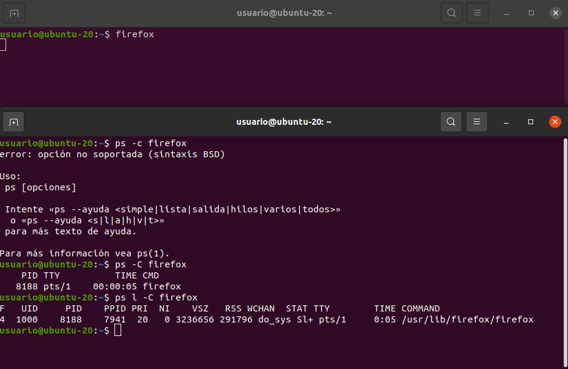
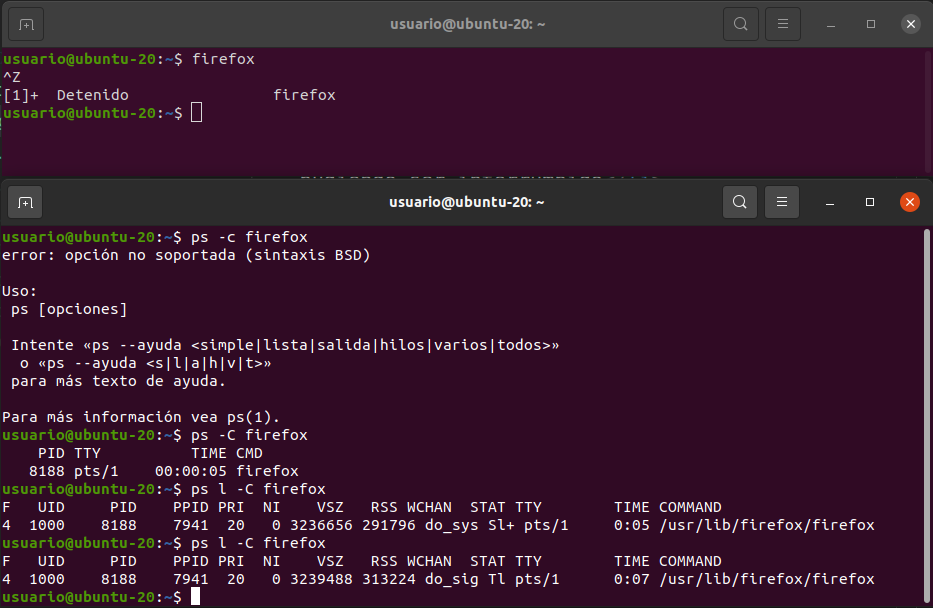
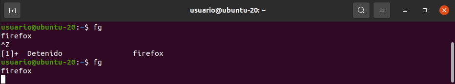
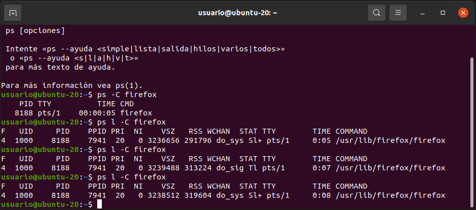
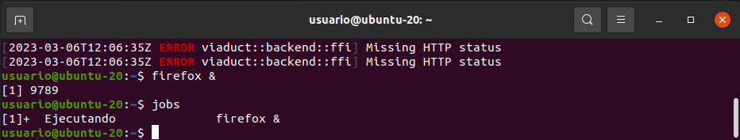
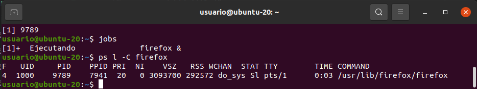
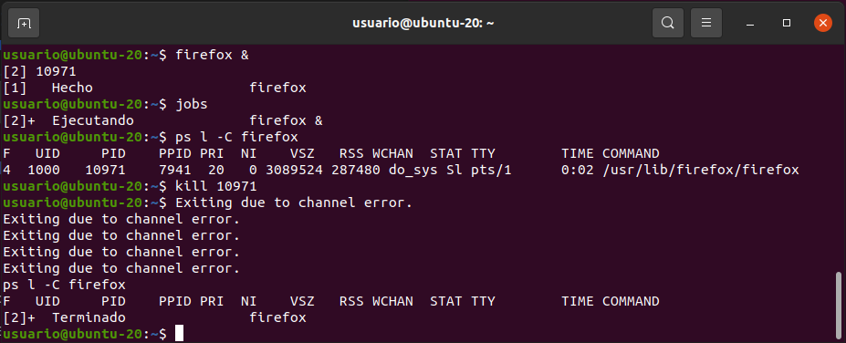
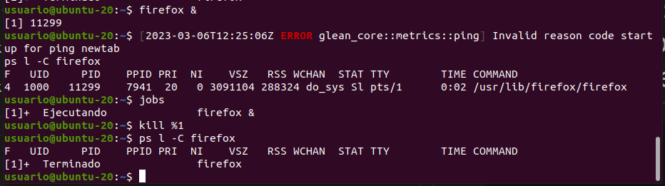
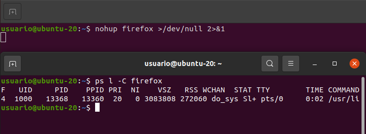
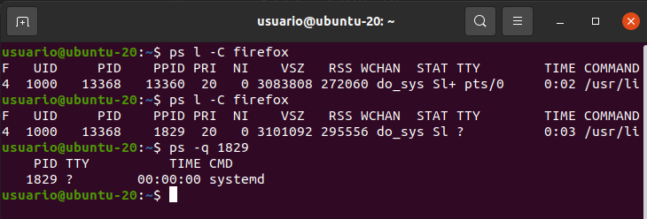

# Procesos A

## 1. Muestre todos los procesos del sistema

    ps -e

## 2. Muestre los procesos del usuario root

    ps -u root

## 3. Ejecute el comando Firefox y desde otra terminal, compruebe el estado del proceso creado, ¿cuál es?

    ps l -C firefox

El estado es Sl+:
<ul>
    <li>S: indica que el proceso está dormido, pudiendo ser interrumpido</li>
    <li>l: indica que es un proceso multihilo</li>
    <li>+: indica que el proceso pertenece al grupo de procesos en primer plano</li> 
</ul>

# 4. En la terminal que ejecutó firefox, pulse la combinación de teclas Ctrl+Z, ¿qué ocurre?

    Ctrl. + Z

El proceso se detiene. La ventana del navegador no se cierra, pero no se puede interactuar con ella.

# 5. Vuelve a comprobar el estado del proceso, ¿cuál es?

El nuevo estado es Tl:
<ul>
    <li>T: detenido por una señal de "job control"</li>
    <li>l: proceso multihilo</li>
</ul>

# 6. En la terminal donde ejecutó el firefox ejecute el comando 'fg', ¿qué ocurre?

    fg

La ventana del navegador vuelve a responder a las acciones del usuario de forma habitual. 

# 7. Vuelva a comprobar el estado del proceso, ¿cuál es?

El estado vuelve a ser Sl+. Con 'Ctrl+Z' el proceso se detuvo, con 'fg' el proceso pasó a primer plano (+) y paso de deteneido (T) a dormido (S).

# 8. Cierre el navegador y ejecute el comando 'firefox &', ¿qué ocurre?

    firefox &

Se lanza el navegador. Puedo interactuar con el de manera habitual y la terminal me indica el id de trabajo asignado al mismo.

# 9. Indique el comando que permita ver la información del proceso generado en el ejercicio 8

    ps l -C firefox

Se puede observar que el proceso está dormido (S) pero no está en primer plano (+).

# 10. Envía una señal de parada (usando kill) para el proceso generado en el ejercicio 8

    kill "PID" 

    kill "%job_id"

La terminal me da algunos errores que no entiendo, pero no me afectan (creo) para el objetivo de la práctica. Me parece que tiene que ver con la funcionalidad que intenta recuperar las pestañas abiertas.

# 11. Ejecute el comando 'firefox &' y cierre la terminal donde se ejecutó el comando, ¿qué ocurre con el navegador?

El navegador se cierra una vez cerrada la terminal.

# 12. Defina un comando que permita ejecutar el navegador firefox aunque se cierre la terminal

    nohup firefox >/dev/null 2>1& 

Con 'nohup' ejecuto el proceso sin que quede pendiente del 'hangup' del padre, que lo terminaría. En este caso, como no me interesan las salidas, las redirijo /dev/null. Si quisiera guardarlas las redirigiría a un fichero.

Una vez cierro la terminal, el navegador sigue abierto. Como se puede observar en la captura de pantalla, el PPID asociado cambia tras cerrar la terminal. El nuevo "padre" es 'systemd', es decir, el último proceso que se detendría al cerrar el sistema. 

# 13. Con respecto a la información de un proceso, ¿qué diferencia hay entre prioridad y nice? ¿Qué significa un valor negativo?

La prioridad es el valor que maneja el kernel de Linux a la hora de gestionar los procesos. Puede tomar valores entre 0 y 139. Las prioridades 0 a 99 son para ejecuciones "en tiempo real" y las prioridades 100 a 139 son para los usuarios. Los valores de 'nice' los puede definir el usuario con la intención de modificar la prioridad que el sistema le da al proceso. 'Nice' toma valores de -20 a +19, siendo -20 el modificador más alto y +19 el más bajo. Por defecto los procesos son lanzados con un valor de 'nice' de 0.

Por detrás, lo que ocurre es que 'nice' (NI) se relaciona con la prioridad de la tarea (PR) de la siguiente manera:

    PR = 20 + NI

Con lo que PR tomaría valores de entre 0 y 39. El valor de PR sirve para mapear la prioridad del proceso de cara al kernel de 100 a 139, es decir, los valores que el usuario puede controlar. No se puede modificar la prioridad de un proceso mediante 'nice' para que sea atendido "en tiempo real".

