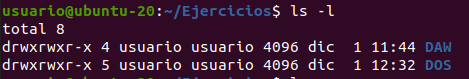
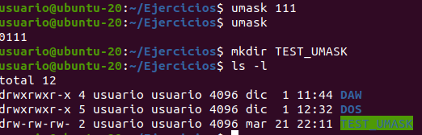

# Ejercicios de permisos en GNU/Linux

## 1. Sobre el comando que se utiliza para modificar los permisos, indica lo siguiente

### 1. ¿Qué comando es?

    chmod

### 2. ¿Qué opción debo usar para que me vaya mostrando todos los ficheros y directorios afectados?

    chmod -v, --verbose

### 3. ¿Qué opción debo usar para que me vaya mostrando sólo los ficheros y directorios que han cambiado el permiso?

    chmod -c, --changes

## 2. El comando para cambiar los permisos tiene una opción para no sólo cambiar los permisos de un directorio, sino también de TODOS su contenido, incluyendo subdirectorios.

### 1. ¿Qué opción permite eso?

    chmod -R, --recursive

### 2. ¿Por qué puede ser MUY peligroso asignar el mismo permiso a todo el contenido de un directorio?

Se pueden facilitar ataques al sistema. Por ejemplo haciendo que todo lo que contenga el directorio pueda ser ejecutado.

### 3. Investiga cómo se podría evitar este problema que has comentado en el apartado anterior

??

## 3. Indica cómo se ven los permisos de ficheros y directorios en GNU/Linux y qué significa cada uno de ellos. ¿Cómo veo quién es el propietario del fichero y a qué grupo pertenecen?

    ls -l

En la primera columna se muestra una secuencia de 10 caracteres. El primer caracter indica si se trata de un directorio (d), un archivo (-) o un enlace (l). El resto de caracteres, tomándolos de 3 en 3, indican los permisos de lectura (r), escritura (w) y ejecución (x) para el propietario, los usuarios del mismo grupo que el propietario y otros respectivamente. En el ejemplo de la imagen, las dos filas impresas en la terminal muestran los permisos de dos directorios (d). En ambos casos propietario, usuarios de su mismo grupo y otros tienen los tres permisos (rwx).

## 4. Sobre los permisos

### 1. ¿Cuáles son los permisos más comunes para ficheros y directorios y qué implican?

r: permiso de lectura, permite abrir, copiar, etc.

w: permiso de escritura, permite borrado,             modificación, etc.

x: si es binario, permite ejecutarlo

### 2. Cuando creas un fichero cualquiera en tu equipo, ¿qué permisos se establecen por defecto y qué permiten y qué no?

ficheros --> 0777 = rwxrwxrwx

### 3. Y si en vez de crear un fichero creas un directorio, ¿cuáles son los permisos por defecto?

directorios --> 0666 = rw-rw-rw-

### 4. Investiga cómo se podrían cambiar estos permisos por defecto

Se utiliza una máscara que se resta al valor por defecto. La máscara se puede definir mediante el comando 'umask'.

Notese que este valor es local a la instancia actual de la terminal. Si lanzamos una nueva terminal tendrá de nuevo el valor por defecto para la máscara.

## 5. Crea 10 archivos en tu equipo, desde fich01 a fich10. Elige los permisos más adecuados para los siguientes casos e indica el comando y opciones para asignarle los permisos:

### 1. fich01: Es un documento confidencial en el que estás trabajando tú con tu equipo

    chmod 770 fich01

### 2. fich02: Son unas instrucciones que deberían poder ser consultadas por todos, pero sólo tú puedes modificarlas
    
    chmod 744 fich02

### 3. fich03: Es un documento muy confidencial, sólo tú deberías tener acceso

    chmod 700 fich03

### 4. fich04: Es un documento compartido que todos deberían poder leer y modificar
    
    chmod 777 fich04
    
### 5. fich05: Es un documento que estás modificando y que, además de ti, sólo podrá ser consultado por tu grupo, sin que pueda modificarlo
    
    chmod 740 fich05

### 6. fich06: A este documento falta por añadirle el permiso para que otros puedan leerlo y escribirlo

    chmod 771 fich06

### 7. fich07: Este documento podía ser modificado por tu grupo y otras personas, pero ahora has decidido que sólo tú puedas modificarlo
    
    chmod 744 fich07
    
### 8. fich08: Es un script  que cualquiera puede ejecutar, pero sólo tú puedes modificar
    
    chmod 755 fich08
    
### 9. fich09: Es un script que tanto tú como tu equipo pueden modificar y ejecutar

    chmod 774 fich09

### 10. fich10: Es un documento que quieres proteger para que sólo tú puedas leerlo, pero no modificarlo

    chmod 400 fich10
